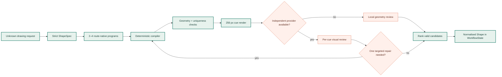

# Free-text AI drawing pipeline

Unknown or compound shape descriptions use a bounded, provider-neutral drawing
pipeline. Built-in templates and text outlines still avoid unnecessary model
calls.



1. A strict `ShapeSpec` preserves subject, modifiers, pose, part hierarchy and
   three to six route-scale recognition cues.
2. Complexity and ambiguity select two to four competing candidates.
3. The generator emits `move`, `line`, cubic `curve` and `close` commands. Each
   contour interval names the recognition cue it represents.
4. The deterministic compiler rejects invalid coordinates, collapsed shapes,
   self-intersections, long inter-stroke transfers, stock-template duplicates
   and duplicate candidates. It also measures cue coverage.
5. Candidates are rendered to 256 px PNG thumbnails. When a different configured
   provider is available, it independently scores every cue, subject identity,
   silhouette and route readability. A local geometry review is used otherwise
   and is never presented as a semantic score.
6. Missing cues, wrong relations and geometry failures produce typed diagnostics
   for at most one targeted repair. Passing contour spans are preserved.
7. The chosen shape stores its spec, candidate count, generator identity and
   review metadata. The API exposes these fields and logs a structured
   `shape.ai.generated` event.

## Linked-image fast path

A public image URL uses a dedicated visual path instead of being interpreted
from its filename. SVG geometry is sampled and used directly, avoiding a model
round trip while preserving the exact source vectors. Other files are
identified from their contents with Pillow, not their extension. Every
decodable raster is EXIF-
oriented, limited to 40 million source pixels, reduced to at most 1024 px on
either axis, flattened onto white, and encoded once as PNG. Animated or layered
inputs use their first rendered frame. Downloads remain limited to 5 MB and
private-network destinations are rejected.
The 64 most recent normalised URLs are cached per server process, so retrying
the same link avoids another download and decode; cached values are copied
before use.

For raster input, a routeable local silhouette is prepared during that same
decode. The authoritative reference image, semantic `ShapeSpec`, and exactly
two GPS-art programs are then handled in one strict-schema multimodal call. The
call tries only the primary provider, uses a 30-second provider deadline, and
does not start an independent reviewer or repair call. If the provider times
out or emits invalid geometry, generation continues immediately from the local
silhouette instead of cascading through slow providers. A misplaced model
`close` command is moved to the end of its stroke locally so an otherwise valid
drawing does not require another request.

OpenCode structured work defaults to the image-capable `gpt-5.4-mini`. A live
minimal strict-schema probe in the development environment completed in 1.96 s
on that model versus 9.46 s on `gpt-5.6-luna`; deployments can still override
the model with `OPENCODE_STRUCTURED_MODEL`. The browser stops image requests
after 120 seconds and other generation after 180 seconds, preserves the exact
image payload for retry, and shows rotating progress messages plus elapsed time
while work is in flight.

This follows OpenCode's documented image-normalisation model and image-capable
model metadata:

- <https://dev.opencode.ai/docs/config#image-attachments>
- <https://opencode.ai/v2/docs/models>
- <https://dev.opencode.ai/docs/zen>

The accepted raster set is the set Pillow can decode in the deployed build,
which is intentionally broader than a fixed PNG/JPEG/WebP allowlist:
<https://pillow.readthedocs.io/en/stable/handbook/image-file-formats.html>.
Pillow 12 also officially supports Python 3.14:
<https://pillow.readthedocs.io/en/stable/installation/python-support.html>.

Run the multilingual benchmark without street-routing calls:

```powershell
python scripts/benchmark_ai_shapes.py --output ai-shape-report.json
```

For a genuinely independent visual review, configure at least two providers in
`LLM_FALLBACK`. The generator's provider is excluded from the reviewer call.
Use `OPENAI_MODEL`, `ANTHROPIC_MODEL`, `OPENCODE_MODEL`, or `OLLAMA_MODEL` when
overriding a fallback provider's default model; `LLM_MODEL` applies to the
first provider in the resolved primary/fallback order.
`AI_SHAPE_VERIFIER_ENABLED=false` disables that call. Candidate count and the
semantic repair threshold are controlled by `AI_SHAPE_MAX_CANDIDATES` and
`AI_SHAPE_MIN_SEMANTIC_SCORE`.
