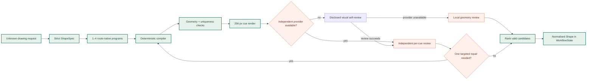

# Free-text AI drawing pipeline

Unknown or compound shape descriptions use a bounded, provider-neutral drawing
pipeline. Built-in templates and text outlines still avoid unnecessary model
calls.



1. A strict `ShapeSpec` preserves subject, modifiers, pose, part hierarchy and
   three to six route-scale recognition cues.
2. Complexity and ambiguity normally select two to four competing candidates,
   capped to one by the zero-cost production profile. A bounded
   typed scaffold is also available for common high-risk silhouettes such as a
   robot with umbrella, bicycle, platypus, coffee cup, crowned dragon, phoenix,
   key, sailboat, astrolabe and spiral galaxy. These are complete ShapeSpec-
   grounded route geometries, not generic label fallbacks.
3. The generator emits `move`, `line`, cubic `curve` and `close` commands. Each
   contour interval names the recognition cue it represents. Both generation
   and repair prompts explicitly require one leading `move` per stroke, after a
   live repair tried to embed a second subpath in one stroke.
4. The deterministic compiler rejects invalid coordinates, collapsed shapes,
   self-intersections, long inter-stroke transfers, stock-template duplicates
   and duplicate candidates. It also measures cue coverage. If cubic controls
   alone create a loop, the compiler retries the same labelled endpoints as
   straight segments. A still-crossed single closed linear outline receives a
   bounded 2-opt edge-order repair that preserves all authored endpoints and
   cue ids. The result must then pass the full validation suite; other crossed
   or unrepaired contours remain invalid.
5. Candidates are rendered to 256 px PNG thumbnails. The verifier first tries
   one different configured provider. If none can answer, the generation
   provider receives a separate temperature-zero critic call instead of leaving
   candidate selection semantically blind. Its result is marked
   `rendered-image-self-review` and `independent=false`; only a different
   provider is labelled independent. A local geometry review is used when both
   visual attempts fail and is never presented as a semantic score. A malformed
   independent review also falls through to the disclosed self-review path.
   Image-to-candidate mappings are explicit, so filtering an invalid middle
   candidate (for example retaining original indices 0 and 2) cannot shift the
   review onto the wrong geometry. Every retained candidate must be reviewed
   exactly once. A questioned typed scaffold can receive one isolated render
   review to prevent neighbouring contact-sheet drawings from contaminating
   its cue verdict; the isolated result replaces the comparison only when it is
   strictly better by missing-cue count and then score.
6. Candidate ranking first minimises missing required cues, then relationship
   defects, before considering the aggregate visual score. Missing cues, wrong
   relations, a below-threshold rendered score, and geometry failures produce
   typed diagnostics for at most one targeted repair. Passing contour spans are
   preserved; optional reviewer suggestions alone do not trigger a repair.
7. The chosen shape stores its spec, candidate count, generator identity and
   review metadata. The API exposes these fields and logs a structured
   `shape.ai.generated` event.

Strict-response limits are stage-specific rather than inherited from the 2K
general LLM default: 6K for the semantic spec, 8K for up to four compact
programs, 6K for the single repair, and 4K for cue review. These are ceilings,
not requested verbosity. Geometry prompts target 12–36 commands per complete
candidate so road-scale identity is retained without bloating JSON.
The 6K/8K geometry and repair calls receive a 45-second transport timeout;
smaller spec and review calls remain at 30 seconds. Workflow and browser
deadlines still bound the complete request. OpenCode retries one structured
transport timeout once at 45 seconds. A response stopped specifically by its
output-token ceiling is retried once with twice the allowance, capped at 16K.
Neither response-level condition opens the provider reachability cooldown.
The benchmark logs a sanitised validation reason for invalid specs, repairs and
reviews, but never raw provider payloads, prompts, keys or image data. Fallback
records also include the same user-facing error returned by the workflow.

## Linked-image fast path

A public image URL uses a dedicated visual path instead of being interpreted
from its filename. SVG geometry is sampled and used directly, avoiding a model
round trip while preserving the exact source vectors. Other files are
identified from their contents with Pillow, not their extension. Every
decodable raster is EXIF-
oriented, limited to 40 million source pixels, reduced to at most 1024 px on
either axis, flattened onto white, and encoded once as PNG. Animated or layered
inputs use their first rendered frame. Downloads remain limited to 5 MB and
private-network destinations are rejected.
The 64 most recent normalised URLs are cached per server process, so retrying
the same link avoids another download and decode; cached values are copied
before use.

For raster input, a routeable local silhouette is prepared during that same
decode. The authoritative reference image, semantic `ShapeSpec`, and exactly
two GPS-art programs are then handled in one strict-schema multimodal call. The
call tries only the primary provider, uses a 45-second provider deadline, and
does not start an independent reviewer or repair call. If the provider times
out or emits invalid geometry, generation continues immediately from the local
silhouette instead of cascading through slow providers. A misplaced model
`close` command is moved to the end of its stroke locally so an otherwise valid
drawing does not require another request.

The optional direct OpenCode API transport defaults structured work to the
image-capable `gpt-5.4-mini`; this is not used by the zero-cost CLI profile. A live
minimal strict-schema probe in the development environment completed in 1.96 s
on that model versus 9.46 s on `gpt-5.6-luna`; deployments can still override
the model with `OPENCODE_STRUCTURED_MODEL`. The browser stops image requests
after 120 seconds and other generation after 180 seconds, preserves the exact
image payload for retry, and shows rotating progress messages plus elapsed time
while work is in flight.

This follows OpenCode's documented image-normalisation model and image-capable
model metadata:

- <https://dev.opencode.ai/docs/config#image-attachments>
- <https://opencode.ai/v2/docs/models>
- <https://dev.opencode.ai/docs/zen>

The accepted raster set is the set Pillow can decode in the deployed build,
which is intentionally broader than a fixed PNG/JPEG/WebP allowlist:
<https://pillow.readthedocs.io/en/stable/handbook/image-file-formats.html>.
Pillow 12 also officially supports Python 3.14:
<https://pillow.readthedocs.io/en/stable/installation/python-support.html>.

Run the multilingual benchmark without street-routing calls:

```powershell
python scripts/benchmark_ai_shapes.py --output ai-shape-report.json
```

For a genuinely independent visual review, configure at least two providers in
`LLM_FALLBACK`. The generator's provider is excluded from the first reviewer
attempt. With one provider, the disclosed self-review still ranks rendered
candidates and supplies typed repair diagnostics, but is not independent
evidence.
Use `OPENAI_MODEL`, `ANTHROPIC_MODEL`, `OPENCODE_MODEL`, or `OLLAMA_MODEL` when
overriding a fallback provider's default model; `LLM_MODEL` applies to the
first provider in the resolved primary/fallback order.
`AI_SHAPE_VERIFIER_ENABLED=false` disables that call. Candidate count and the
semantic repair threshold are controlled by `AI_SHAPE_MAX_CANDIDATES` and
`AI_SHAPE_MIN_SEMANTIC_SCORE`.

## Zero-cost hosted profile

The production image and Northflank example use `LLM_USAGE_MODE=essential`, the
embedded OpenCode CLI transport, and a named free text model. Built-in symbols,
catalog shapes, lettering, intent parsing, planning, image verification, and
final route review are deterministic and consume no model request. An unknown
custom subject normally starts with two calls: one semantic `ShapeSpec`, then
one geometry candidate. A locally generated semantic scaffold remains as a
second candidate without another call, and topology/cue checks choose between
them. `WORKFLOW_MAX_LLM_CALLS=-1` means bounded repair and retry stages are not
stopped by a global request counter when this free model is selected.

The free model does not receive rendered images. Set
`AI_SHAPE_VERIFIER_ENABLED=false`, `AI_ROUTE_VERIFIER_ENABLED=false`, and
`AI_SHAPE_MAX_CANDIDATES=1` for this profile. If the configured free catalogue
entry disappears or times out, the validated deterministic scaffold keeps the
request functional instead of falling through to a paid provider.
