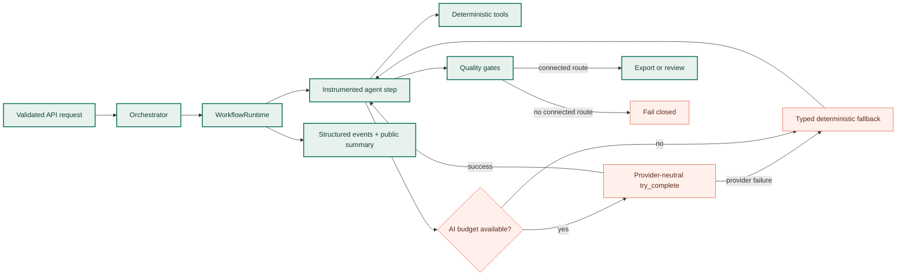

# Production AI workflow

GPS Art Wizard uses AI only where it adds semantic value. Geometry, street
routing, validation, candidate ranking, and export safety remain deterministic
and testable. The workflow runtime adds run-scoped budgets and observability
without changing the route algorithm or coupling agents to a vendor SDK.

## Runtime design



Each agent still implements `run(state) -> state`. `WorkflowRuntime` decorates
that boundary and records a balanced `running`/`completed` or
`running`/`failed` event pair. Refinement, road recovery, and alternative-shape
loops naturally produce increasing attempt numbers for the repeated stage.
Agents continue to exchange typed dataclasses through `WorkflowState`; runtime
events never become a second domain-state channel.

The trace has a bounded event list. Counters continue to advance after the
list is full, and `dropped_events` makes truncation explicit. This prevents an
unexpected recovery loop from growing a response or memory allocation without
limit.

## Run outcome and execution mode

Outcome and AI usage are deliberately separate:

| Field | Values | Meaning |
| --- | --- | --- |
| `status` | `running`, `completed`, `needs_review`, `failed` | Lifecycle/quality outcome |
| `mode` | `ai`, `hybrid`, `deterministic` | Whether successful model calls contributed |
| `degraded_reasons` | bounded reason codes | Examples: provider fallback, deadline, or unmet quality gates |
| `error_category` | `input`, `dependency`, `quality`, `internal` | Coarse failure class without exception text |

A deterministic result is not automatically a failed result. Known templates
and text shapes intentionally avoid model calls. Conversely, successful model
output never bypasses street connectivity or quality gates.

## Budgets and fallback

Budgets are scoped to one generation, not to the process:

- `WORKFLOW_MAX_LLM_CALLS` counts actual provider invocations, including
  fallback-provider attempts. When exhausted, subsequent optional calls use
  the agent's deterministic fallback.
- `WORKFLOW_MAX_DURATION_SECONDS` is an advisory end-to-end deadline. Once it
  expires, new model calls use deterministic fallback. In-flight provider and
  routing calls retain their own transport timeouts.
- `WORKFLOW_MAX_TRACE_EVENTS` bounds stored step events.

The workflow does not abort deterministic validation or export checks when its
advisory deadline expires. Finishing those checks is necessary to preserve the
fail-closed contract: a late computation must not turn an unverified guide into
a downloadable track.

Provider fallback remains in `llm/factory.py`. It consults the active run before
each reachable-provider invocation, records only provider names and integer
usage metrics, and calls the existing local fallback when no attempt is
permitted or successful. Provider/model code still returns the common
`LLMResponse` type.

## Observability and privacy

The runtime emits these structured event families:

| Event | Useful dimensions |
| --- | --- |
| `workflow.started` | run ID, duration and AI-call limits |
| `workflow.step.started` | run ID, stage, attempt |
| `workflow.step.completed` | stage, attempt, duration |
| `workflow.step.failed` | stage, attempt, error category/type |
| `workflow.budget.deadline_exceeded` | run ID |
| `workflow.finished` | status, mode, total duration, attempts/fallbacks |

The generation response includes a compact `workflow` object with the run ID,
status, mode, duration, limits, step counts, AI counters, aggregated token usage,
and reason codes. It does not include lifecycle event payloads, prompts, raw
model output, exception messages, keys, or route geometry. The HTTP
`X-Request-ID`, response `request_id`, and workflow `run_id` are identical when
the request middleware supplied an ID, so one request can be followed across
logs and the client response.

Recommended production dashboards:

- p50/p95 `workflow_duration_ms` split by status and mode;
- `workflow_step_failures` and error category by stage;
- AI attempts, fallback rate, and token usage by provider;
- `needs_review` rate and failed quality gates by city/shape family;
- street-routing `503` rate separately from optional-AI degradation.

Alert on sustained changes, not isolated hard drawings. A high deterministic
fallback rate with stable route quality indicates provider degradation; a high
`needs_review` rate with normal providers indicates an algorithm or street-fit
regression.

## Quality and release workflow

The release gate has three layers:

1. Unit contracts validate lifecycle balance, context isolation, bounded trace
   storage, safe error classification, budget enforcement, usage aggregation,
   and public-summary privacy.
2. Offline end-to-end tests assert the same algorithmic route behavior and now
   also assert the exact linear workflow stages. The full invariant suite keeps
   scale/refinement, ranking, connectivity, and export behavior stable.
3. The multilingual AI-shape benchmark evaluates semantic generation separately
   from paid street routing. Run it before changing prompts, schemas, candidate
   counts, models, or provider adapters:

```powershell
.\.venv\Scripts\python.exe scripts\benchmark_ai_shapes.py --output ai-shape-report.json
```

Do not approve a prompt/model change on a few attractive examples. Compare the
benchmark report and the deterministic test suite, then canary the revision and
watch workflow mode, latency, fallback, quality-gate, and routing-failure rates.

## Extension rules

When adding an AI-capable stage:

1. Add a typed state slot owned by that agent.
2. Keep the node stateless and call the provider-neutral `try_complete` helper.
3. Define a strict output schema and validate/compile its response as untrusted
   data.
4. Supply a bounded deterministic fallback.
5. Register the node in `graph.py`; instrumentation is then automatic.
6. Add lifecycle/budget tests plus domain invariants for the new output.
7. Never let model confidence replace connected-route or export quality gates.
