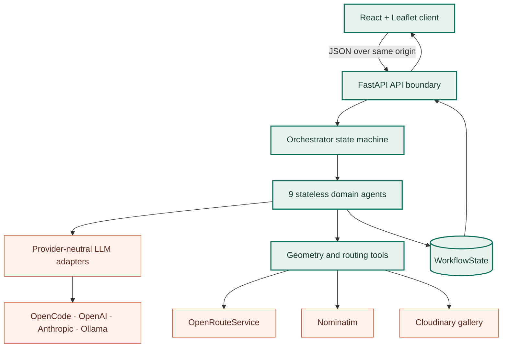

# Architecture

## Component view

For module ownership, call sequence, retry behavior, state classes, and browser state management, continue with the [implementation guide](implementation/index.md).

## Data flow (the state object)

`WorkflowState` carries the complete exchange between nodes. Agents may update
their owned fields during a run, but they do not retain private state between
runs:

| Field | Producer | Consumers |
|-------|----------|-----------|
| `prompt` | API | IntentAgent |
| `intent` | IntentAgent | PlanningAgent, ShapeAgent, PlacementAgent, PreflightAgent |
| `plan` | PlanningAgent | ShapeAgent, PlacementAgent, PreflightAgent |
| `shape` | ShapeAgent | PlacementAgent, PreflightAgent, ValidationAgent |
| `route_draft` | PlacementAgent / PreflightAgent / RefinementAgent | SnapAgent |
| `placement_candidates` | PreflightAgent | Orchestrator road recovery, RefinementAgent |
| `preflight_candidates` | PreflightAgent | API diagnostics |
| `candidates` | ValidationAgent | API acceptance filter, audit, selector/editor |
| `snapped` | SnapAgent | ValidationAgent, ExportAgent |
| `validation` | ValidationAgent | Orchestrator (loop control), RefinementAgent |
| `export` | ExportAgent | API (only `snapped=true` geometry crosses the public response boundary; persistence remains gated) |
| `iterations`, `history` | Orchestrator | RefinementAgent |
| `errors` | any | Orchestrator |

In addition to strategy fields, `plan` persists the resolved `center_lat`,
`center_lon`, and `city_bbox`. Placement consumes that same resolution, so a
normal pipeline geocodes its city once. There is no process-global geocoder
cache; a transient fallback therefore cannot leak into later requests.
Supported cities resolve directly from the curated route database without a
public Nominatim round trip. Common known-template requests also bypass LLM
intent/planning calls. Locally parsed free-form drawings also use deterministic
planning and spend inference only on the vector scaffold. Successful custom
geometry is kept in a bounded versioned cache; fallback output is never cached.

## Why a custom graph, not LangGraph?

The custom graph avoids adding an orchestration framework for one refinement
loop and provider fallback. Its node boundary follows the simple
`def run(state) -> state` convention, which keeps a future framework migration
explicit without coupling the current runtime to one.

## Geo maths

- Unit-space → lat/lon: equirectangular projection around the city centre
  (`tools/geo.py:unit_to_latlon`), good enough for city-scale (<50 km).
- Shape scaling: the intended polyline length includes visible strokes,
  unavoidable transfers, a sport factor, and an empirical shape-specific
  detour prior. Scale is then solved near the target; real ORS measurements
  drive every subsequent correction.
- Rotation: known local map context can suggest a street orientation. The long
  axis of the city bbox is only a coarse city-extent fallback, after which the
  RefinementAgent may test bounded adjustments.
- ORS guidance: authored vertices and sharp corners are protected, then the
  longest uncovered arcs are bisected until guide points are roughly 400 m
  apart or the 50-coordinate provider limit is reached. Sparse shapes therefore
  cannot give the router several kilometres of unconstrained freedom.
- Placement preflight: up to 180 candidates combine a 3×3 city-wide grid, six
  rotations, and three scales. Curvature-preserving guides are sent in one
  ORS nearest-edge snap request and ranked by coverage, collapse resistance,
  snap distance, silhouette, turning, salient-landmark, and length
  preservation. A greedy
  quality/diversity objective avoids spending all seven Directions calls on
  nearly identical placements. Every proxy result and every full route is
  retained; connectivity is still unproven until full routing.
- Shape fidelity: express the intended and routed lines in a shared metric
  frame, resample both by arc length, then combine discrete Fréchet,
  Hausdorff/coverage, tangent sequence, route-length and extent preservation,
  multiscale salient-curvature landmark matching, and excess near-U-turn event
  detection with NumPy
  (`tools/shape_similarity.py`). Route direction and the start vertex of a
  closed loop do not affect the score.
- Acceptance: `quality.py` is the single source of truth shared by the
  orchestrator, API, edit endpoint, and exporter. It independently gates shape
  identity, connected routing, aggregate score, ordered curve, coverage,
  turns, landmarks, unintended reversals, detour, extent, distance, and closure for automatic
  verification. The API selector contains every fully routed candidate for the
  final selected shape. Internal compatibility fields still use `verified` and
  `review`, while the UI presents the non-scientific labels “Checks passed” and
  “Review”. Other-shape attempts retain metrics and failed-gate IDs in
  `candidate_audit`.
- Candidate selection: selected-shape candidates that pass every export gate
  form the first partition. Within each partition, every numeric gate is
  normalised to its minimum and the weakest gate is the primary ranking key;
  aggregate score is only a late tie-breaker. This prevents a high average from
  placing a failed recognition gate ahead of a route that passes every check.
- Refinement search: the road-fit-ranked shortlist is consumed before a full
  measured scale correction and damped square-root bracket are tried. Tested
  scale/rotation/offset/tolerance signatures are remembered, so an already measured
  candidate cannot consume the remaining iteration budget repeatedly.
- Road recovery: nearest-edge preflight proves proximity, not graph
  connectivity. If the first Directions candidate validates with
  `on_roads=false`, the orchestrator routes the remaining preflight-ranked
  drafts in order and selects the first connected result. Only after a street
  route exists can normal quality refinement begin.
- Smart suggestions score the complete 145-template registry against continuous
  city traits, activity, and distance. Up to three high-scoring continuous
  shapes from different geometry families are measured on the real road
  network. A primary route that already passes both quality gates is accepted
  immediately to avoid unnecessary router calls; otherwise the alternatives
  compete on measured route quality.

## Failure modes & degradation

| Missing | Behaviour |
|---------|-----------|
| No LLM key | an unsupported drawing becomes an explicitly labelled full-word vector fallback; it is never reduced to its initial |
| No ORS key | Preflight is skipped and SnapAgent creates an internal `snapped=False` diagnostic; `POST /generate` returns HTTP 503 with no candidate or GPX/TCX export |
| ORS cannot connect the first placement | orchestrator tries every remaining preflight-ranked placement before returning HTTP 503 |
| ORS cannot connect edited control points | `POST /edit-route` returns HTTP 503 before GPX/TCX serialisation; the editor keeps the user's points for retry |
| LLM returns malformed or invalid data | executable geometry checks request one bounded repair, then use the explicit deterministic fallback |
| Validation never reaches threshold | orchestrator returns the best iteration + a `below_threshold` flag |
| Any quality gate other than road connectivity fails | a road-routed selected-shape attempt remains selectable and editable; its measurements are explained and explicit acceptance enables GPX |
| Geocoder rate-limited | city centre falls back to the configured default city |

## Testing strategy

- `tests/test_pipeline.py`: offline end-to-end (no keys) using the sample
  prompt, asserting the internal guide is marked non-routable and the loop
  terminates without claiming street connectivity.
- `tests/test_skills.py`: skill discovery, routing, and prompt injection.
- `tests/test_route_engine.py`: parser boundaries, geometry edge cases,
  explicit offline-city substitution, direction-independent similarity,
  waypoint budgeting, ORS request semantics, preflight ranking/index
  preservation, city-wide shortlist generation, self-hosted routing, measured
  refinement direction, practical omitted-distance defaults, routable
  templates, export quality gates, preview limits, provider caching, and
  invalid prompt handling.
- `tests/test_api_contracts.py`: request whitespace normalisation, Pydantic
  coordinate and length boundaries, legacy acceptance compatibility, safe
  422/500 error mapping, fail-closed 503 generation, request-ID propagation,
  oversized edit rejection, and the health/gallery capability contract.
- `tests/test_config.py`: boolean/list environment parsing, YAML overlay
  application, environment precedence, numeric distance defaults, and the
  explicit settings-cache lifecycle.
- Pipeline and API tests verify that a gate-passing candidate ranks ahead of a
  higher-average failed candidate, unrouted candidates never become selectable
  or downloadable, and road recovery tries the remaining shortlist.
- Unit tests for shape templates, geo maths, routing helpers, validation, and
  API serialisation run without paid services. Gallery tests cover token
  tampering/expiry, PNG sanitisation, Cloudinary response filtering, and
  deletion authorization without contacting Cloudinary.
- Playwright functional tests exercise the built user interface with explicit
  desktop/mobile/tablet assertions, including the searchable 158-option catalog,
  grouped 50-city Hungary and 136-city Europe structured picker,
  generator focus, prompt limits and keyboard submission, the animated waiting
  journey and cancellation, responsive containment, result wording, candidate
  switching, editor success and failure recovery, fail-closed straight-line
  previews, safe download gates, gallery storage failures,
  publication, pagination/removal, and gallery layout. Their API responses are
  deterministic and do not consume external service quotas.

The Python suite defaults to strict configuration and marker validation. Set
`GEOCODE_OFFLINE=1` for deterministic local and CI runs.
See [testing.md](testing.md) for the complete local and CI workflow.
