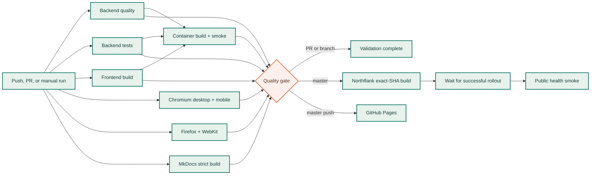

# CI/CD and release delivery

The repository uses `.github/workflows/ci.yml` as one explicit release graph.
Pull requests and branch pushes run the same deterministic validation. A
`master` push can reach Northflank and GitHub Pages only through the stable
`Quality gate` job.

## Design principles

The workflow follows the controls recommended by GitHub and Northflank:

- independent checks run in parallel, while `needs` expresses only real
  dependencies;
- one aggregate status check makes branch protection stable even when a test
  matrix changes;
- every action is pinned to an immutable full commit SHA, with the readable
  release tag kept in a comment;
- workflow permissions are read-only by default and write permissions exist
  only on the Pages deployment job;
- dependency caches are managed by `setup-python` and `setup-node`, while test
  reports and failure diagnostics are uploaded as artifacts;
- feature-branch and pull-request runs supersede stale runs, but a production
  release is never cancelled halfway through;
- the Northflank production environment owns its token and deployment
  variables, and can add reviewers or branch restrictions without editing the
  workflow;
- Northflank's direct repository CI is disabled, so a Git push cannot bypass
  the GitHub quality gate.

Dependabot checks the pinned GitHub Actions references weekly using
`.github/dependabot.yml`.

## Required pre-deployment jobs

| Job | Contract | Timeout |
| --- | --- | --- |
| `backend-quality` | Editable `.[dev,all]` install, Ruff, mypy | 15 min |
| `backend-tests` | Complete offline pytest suite and JUnit artifact | 20 min |
| `frontend-build` | Lockfile-only install and optimized Vite build | 15 min |
| `ui-tests` | Required matrix: desktop/mobile Chromium plus desktop Firefox/WebKit; Playwright diagnostics uploaded | 30 min per matrix leg |
| `docs` | `mkdocs build --strict`; prepares the Pages artifact on `master` pushes | 15 min |
| `container` | Builds the root production Dockerfile, starts it as the non-root runtime user, verifies `/health` and the compiled SPA | 25 min |
| `quality-gate` | Fails unless every job above finished with `success` | 5 min |

The container job begins only after the backend checks and frontend build have
passed. The browser matrix and documentation build can continue in parallel.
Neither application nor documentation deployment can start until the aggregate
gate succeeds.



## Northflank production gate

The current application uses a Northflank combined service. Combined services
enable their own CI/CD by default; leaving that CI toggle enabled would start a
build immediately on every push and bypass GitHub's checks. Configure it once
as follows:

1. Open the combined service's **CI/CD** controls in Northflank.
2. Disable **CI** so repository pushes do not start builds directly.
3. Keep **CD** enabled so a successful, explicitly requested build rolls out.
4. Create a Northflank API token with the narrow project permissions
   **Services → General → Read** and **Update**.
5. In GitHub, create an environment named `northflank-production`.
6. Add environment secret `NORTHFLANK_API_TOKEN`.
7. Add environment variables `NORTHFLANK_PROJECT_ID`,
   `NORTHFLANK_SERVICE_ID`, and `NORTHFLANK_PRODUCTION_URL` (the public HTTPS
   origin without `/health`). Add `NORTHFLANK_TEAM_ID` only for a team-scoped
   Northflank project.
8. Restrict that GitHub environment to `master`; optionally require a reviewer
   for production.

The deployment helper first reads the service and refuses to proceed unless it
is a combined service with Northflank CI disabled. It then asks Northflank to
build `github.sha`, verifies the accepted SHA, polls that build to success,
waits for a newer completed deployment transition, and checks the public
`/health` response. A missing variable, failed build, disabled CD, failed
rollout, wrong SHA, or unhealthy endpoint fails the deployment job.

The API token is never passed to pull-request jobs. Environment protection
rules are evaluated before GitHub exposes it to the deployment runner.

## Triggers and concurrency

Every pull request targeting `master`, every merge-queue candidate, and every
`master` push runs the complete pre-deployment graph. Restricting the push
trigger to `master` avoids running the same feature-branch revision once for
the push and again for its pull request. A normal `master` push deploys after
the quality gate. `workflow_dispatch` can rerun all checks without releasing;
set `deploy_northflank=true` while dispatching the `master` branch to perform a
controlled redeployment after those checks pass.

New pull-request and feature-branch commits cancel obsolete runs for the same
ref. Runs on `master` are not cancelled, and the Northflank deployment job has
its own `northflank-production` concurrency group so production rollouts never
overlap.

## Branch and environment protection

Protect `master` in **Settings → Branches** or with a repository ruleset:

1. require a pull request before merging;
2. require the `Quality gate` status check and require the branch to be current;
3. block force pushes and branch deletion;
4. restrict the `northflank-production` GitHub Environment to `master`;
5. add a required production reviewer if the repository plan and release policy
   call for manual approval.

Using only `Quality gate` as the required check keeps the ruleset stable when a
matrix label or internal job is reorganized. The aggregate job uses `always()`
so it reports an explicit failure instead of disappearing as `skipped` when an
upstream job fails.

## GitHub Pages

In **Settings → Pages**, select **GitHub Actions** as the source. The `docs` job
builds with warnings as errors on every run, but uploads a Pages artifact only
for a `master` push. `deploy-docs` needs both `docs` and `quality-gate`, and is
the only job with `pages: write` and `id-token: write`.

The published site is:

```text
https://ak91hu.github.io/CityShapeRunner/
```

## Test diagnostics

The backend job publishes `backend-test-results` with JUnit XML. Each browser
matrix leg publishes its HTML report, screenshots, traces, and error context as
a separate `playwright-*` artifact. Artifacts are retained for 14 days and are
uploaded even when a test fails, unless the whole job was cancelled.

The live `prod-gallery.spec.js` suite is intentionally not a pre-deployment
test. It calls the already deployed public service, consumes real routing/model
quota, can publish external Cloudinary state, and therefore cannot validate a
not-yet-deployed revision. The deterministic mocked gallery, generation,
editing, export, responsive, accessibility, and cross-browser contracts all run
before deployment; the deployment job then performs the non-destructive live
health smoke.

## Failure and rollback

| Failure | Effect | Investigation |
| --- | --- | --- |
| Lint, type-check, pytest, Vite, Playwright, MkDocs, or container smoke fails | `Quality gate` fails; neither Northflank nor Pages deploys | Reproduce the displayed command; download the relevant test artifact |
| Northflank CI is still enabled | Deployment fails before requesting a build | Disable CI on the combined service; keep CD enabled |
| Northflank CD is disabled | Deployment fails before requesting a build | Enable CD on the combined service; keep direct CI disabled |
| Northflank API request or build fails | No new healthy image is rolled out | Inspect the build ID and Northflank build logs |
| Rollout fails | Deployment polling times out or reports failure | Inspect Northflank deployment and health-check logs |
| Public health smoke fails | GitHub marks the release failed | Inspect Northflank container and health-check logs; roll back if necessary |
| Pages deployment fails | Application release is unaffected | Confirm Pages source, permissions, artifact, and environment rules |

Roll back the application by selecting the last healthy Northflank deployment,
or revert the responsible commit on `master`; the revert must pass the same
complete gate. Restore documentation by reverting its source/configuration and
letting the workflow rebuild it. Do not manually publish generated `site/`
content.

## Upstream references

- [GitHub: workflow syntax](https://docs.github.com/en/actions/reference/workflows-and-actions/workflow-syntax)
- [GitHub: jobs, dependencies, and matrices](https://docs.github.com/en/actions/how-tos/write-workflows/choose-what-workflows-do/use-jobs)
- [GitHub: dependency caching](https://docs.github.com/en/actions/reference/workflows-and-actions/dependency-caching)
- [GitHub: secure use of Actions](https://docs.github.com/en/actions/reference/security/secure-use)
- [GitHub: deployments and environments](https://docs.github.com/en/actions/reference/workflows-and-actions/deployments-and-environments)
- [Northflank: manage CI/CD](https://northflank.com/docs/v1/application/release/manage-ci-cd)
- [Northflank API: start a service build](https://northflank.com/docs/v1/api/project/services/start-service-build)
- [Northflank API: inspect a service build](https://northflank.com/docs/v1/api/project/services/get-service-build)
