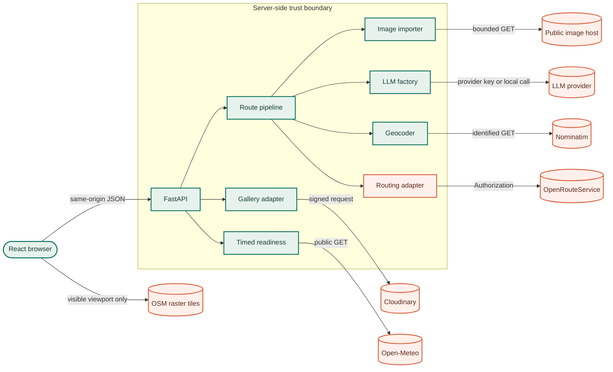
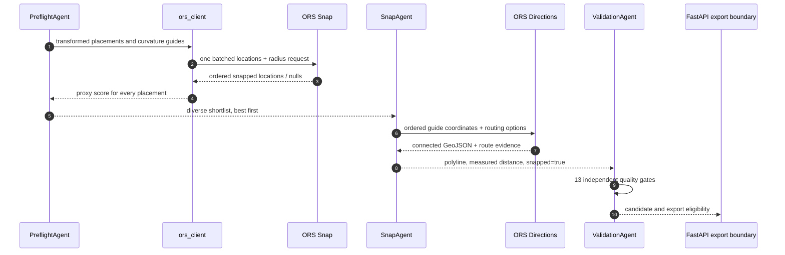
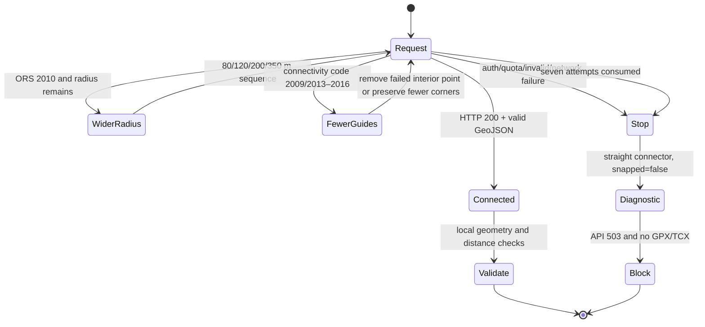
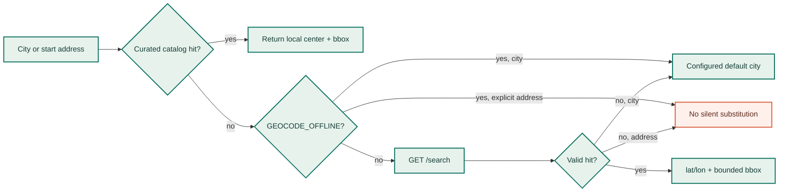
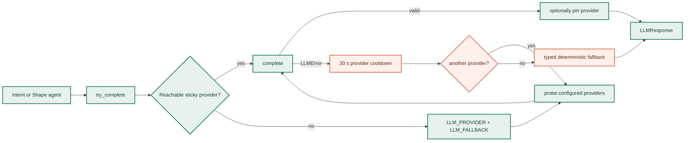
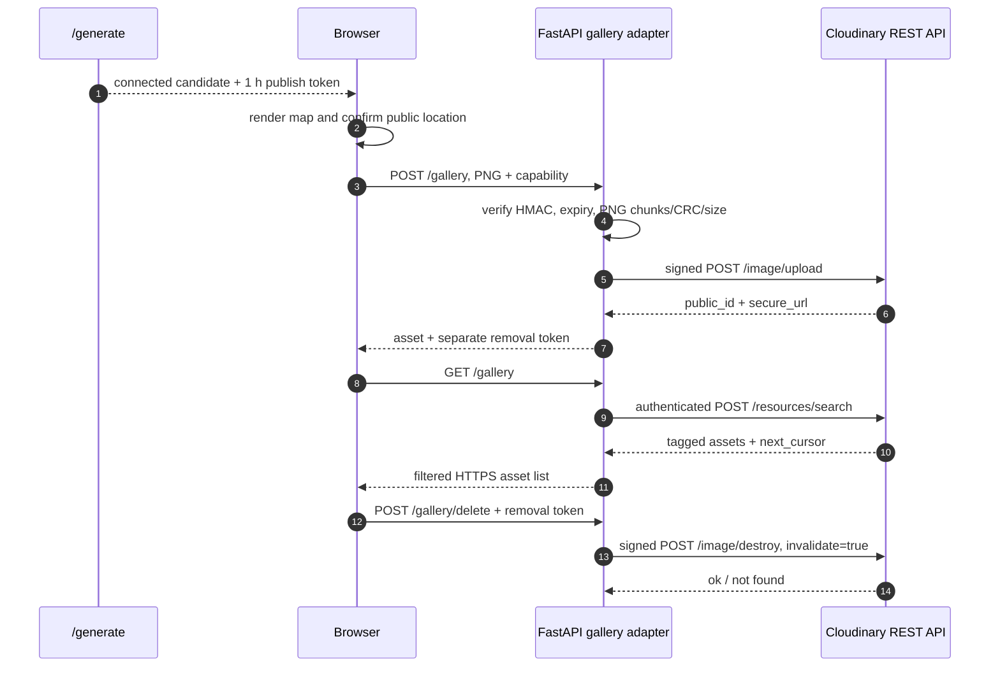
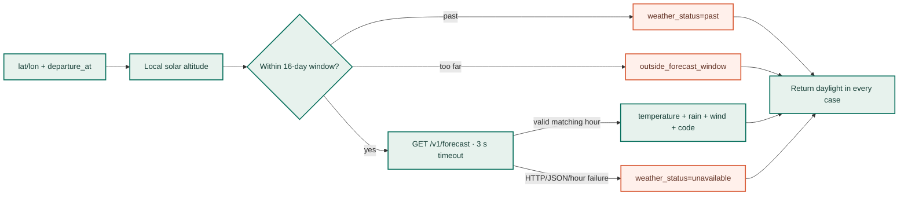
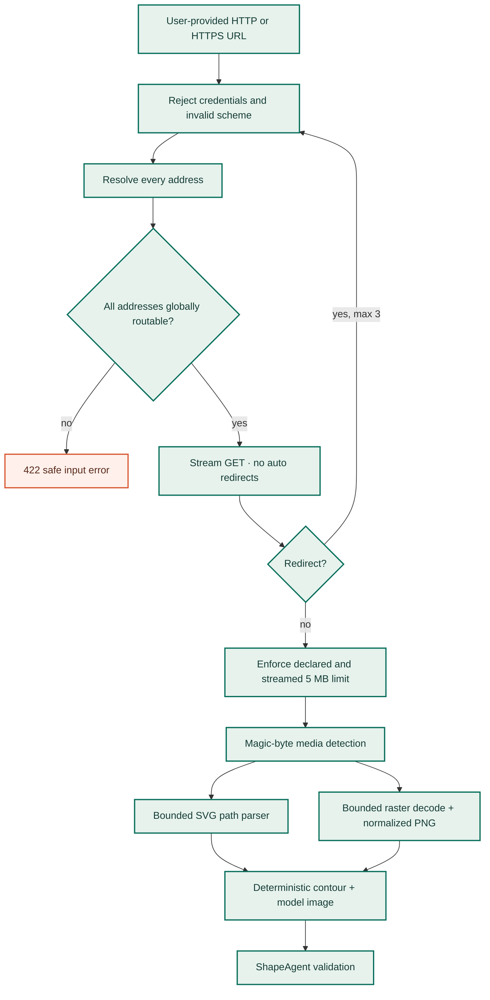
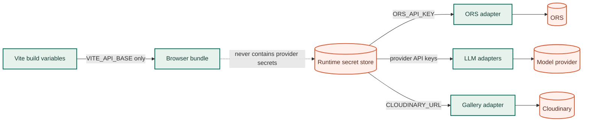

# External API integrations

<div class="api-hero" markdown>

# The services behind a street-valid drawing

GPS Art Wizard keeps its own HTTP contract separate from its provider adapters. The browser talks only to FastAPI; routing, geocoding, model inference, weather, image storage, and remote image import cross independently controlled server-side boundaries.

[Internal HTTP API](api-reference.md){ .md-button .md-button--primary }
[Configuration matrix](configuration-reference.md){ .md-button }

<div class="api-kpis" markdown>

<div><strong>7</strong><span>integration areas</span></div>
<div><strong>2</strong><span>ORS endpoint families</span></div>
<div><strong>4</strong><span>LLM adapters</span></div>
<div><strong>0</strong><span>browser-side secrets</span></div>

</div>

</div>

## Integration map

<figure class="api-ecosystem-figure">
  
  <figcaption>The application boundary, external providers, credential paths, and degradation modes at a glance.</figcaption>
</figure>

<div class="api-service-grid" markdown>

<div class="api-service-card api-critical" markdown>

<span class="api-monogram">ORS</span>

### OpenRouteService

Street snapping, connected directions, elevation, surface, steepness, and way-type evidence.

**Export critical** · server-side key

[Routing details](#openrouteservice-ors)

</div>

<div class="api-service-card" markdown>

<span class="api-monogram">OSM</span>

### Nominatim + tiles

Fallback place lookup on the server and interactive raster map tiles in the browser.

**Graceful degradation** · attribution required

[Map services](#openstreetmap-services)

</div>

<div class="api-service-card" markdown>

<span class="api-monogram">AI</span>

### Model providers

OpenCode Zen, OpenAI, Anthropic, or local Ollama behind one provider-neutral interface.

**Optional** · deterministic fallback

[Provider layer](#llm-provider-layer)

</div>

<div class="api-service-card" markdown>

<span class="api-monogram">CLD</span>

### Cloudinary

Signed upload, tagged search, HTTPS delivery, and capability-protected deletion of gallery PNGs.

**Optional feature** · server-side secret

[Gallery flow](#cloudinary-gallery)

</div>

<div class="api-service-card" markdown>

<span class="api-monogram">WX</span>

### Open-Meteo

Hourly temperature, precipitation, weather code, and wind context for a chosen departure.

**Advisory** · three-second timeout

[Weather flow](#open-meteo-forecast)

</div>

<div class="api-service-card" markdown>

<span class="api-monogram">IMG</span>

### Public image import

Bounded HTTP(S) download with DNS/IP checks, redirect revalidation, decoding limits, and sanitisation.

**Untrusted input** · no credentials forwarded

[Import boundary](#public-image-import)

</div>

</div>

## Boundary and criticality model



| Integration | Caller | Credential | Route export dependency | Failure behavior |
| --- | --- | --- | --- | --- |
| OpenRouteService | Python backend | `ORS_API_KEY` for hosted service | **Required** | no connected route crosses the API boundary; generation/editing returns `503` |
| Nominatim Search | Python backend | none; identified `User-Agent`, optional email | Conditional | catalogued cities stay local; unresolved explicit addresses return `422` |
| OpenStreetMap tiles | Browser/Leaflet | none | No | map background may be unavailable while route data remains intact |
| OpenCode/OpenAI/Anthropic/Ollama | Python backend | provider key, or local Ollama | No | provider rotation, then deterministic geometry/fallback |
| Cloudinary | Python backend | `CLOUDINARY_URL` | No | gallery is unconfigured or isolated behind `502`/`503` |
| Open-Meteo | Python backend | none | No | daylight remains locally calculated; weather becomes `unavailable` |
| Public image host | Python backend | none | Only for image requests | safe input error; no internal/private destination fallback |

!!! info "Internal API versus provider API"

    `/generate`, `/edit-route`, and `/gallery` are the product's stable public HTTP surface. Provider URLs, payloads, retry rules, and credentials stay behind adapters. Consumers should integrate with the [FastAPI/OpenAPI contract](api-reference.md), not call ORS or Cloudinary on behalf of the application.

## OpenRouteService (ORS)

ORS is the only external dependency that determines whether a generated route can become a selectable/exportable GPS activity. The project uses two different ORS services because proximity to a road is not proof that the ordered points form one connected route.

### Endpoint ownership

| Phase | Request | Project purpose | Authoritative? |
| --- | --- | --- | --- |
| Placement preflight | `POST /v2/snap/{profile}/json` | cheaply measure how up to 180 transformed drawings sit near routable edges | No; it is a ranking proxy |
| Full routing | `POST /v2/directions/{profile}/geojson` | route ordered guide points through the connected graph and return road geometry | **Yes**, followed by local validation |

Profiles are mapped in `tools/ors_client.py`: `run → foot-walking`, `bike → cycling-regular`, with explicit road-bike and mountain-bike variants available internally. Coordinates are sent to ORS as `[longitude, latitude]`; internal domain geometry remains `(latitude, longitude)`.

The official [snapping endpoint](https://giscience.github.io/openrouteservice/api-reference/endpoints/snapping/) returns the nearest graph-edge location or `null` within a radius. The [Directions service](https://giscience.github.io/openrouteservice/api-reference/endpoints/directions/) calculates a route through two or more locations. This distinction is the reason preflight never sets `snapped=true`.



### Directions payload produced by the adapter

```json
{
  "coordinates": [[19.0402, 47.4979], [19.052, 47.501]],
  "preference": "shortest",
  "geometry_simplify": false,
  "instructions": false,
  "continue_straight": false,
  "radiuses": [120, 120],
  "elevation": true,
  "extra_info": ["surface", "steepness", "waytype", "suitability"],
  "options": {
    "avoid_features": ["steps", "ferries", "fords"],
    "profile_params": {
      "weightings": {
        "quiet": {"factor": 1.0},
        "green": {"factor": 0.8}
      }
    }
  }
}
```

`avoid_features` and foot-profile `quiet`/`green` weightings are included only when the user enables them. The supported semantics come from the official [ORS routing options](https://giscience.github.io/openrouteservice/api-reference/endpoints/directions/routing-options). Extra route evidence is interpreted into readiness warnings; ORS documents it under [Directions extra info](https://giscience.github.io/openrouteservice/api-reference/endpoints/directions/extra-info/).

### Bounded retry state machine



The public adapter limits a full routing attempt to 24 visual guides even though the hosted coordinate ceiling is higher. It uses a 5-second connect, 15-second read, 10-second write, and 5-second pool timeout, with at most seven class-aware attempts. Authentication, quota, malformed-request, and network failures stop instead of multiplying identical paid calls.

!!! warning "Current ORS host"

    `ORS_BASE_URL` defaults to `https://api.heigit.org/openrouteservice`. ORS officially scheduled the legacy `api.openrouteservice.org` host for shutdown on **2026-08-24**, so new deployments must not use it. See the [official migration announcement](https://ask.openrouteservice.org/t/deprecating-api-openrouteservice-org-in-favour-of-api-heigit-org/7912).

Implementation: [`gps_art_wizzard/tools/ors_client.py`](https://github.com/ak91hu/CityShapeRunner/blob/master/gps_art_wizzard/tools/ors_client.py)

## OpenStreetMap services

Two OSM-backed services are used through separate clients and policies.

### Nominatim Search API

Supported cities resolve from the local Hungarian/European catalog first. Nominatim is only the fallback for an uncatalogued city or an explicit start address.



The server sends `q`, `format=json`, `limit=1`, `addressdetails=0`, `layer=address`, and—when resolving a city—`featureType=settlement`. It identifies itself with `GPS-Art-Wizard/0.1` and includes `NOMINATIM_EMAIL` when configured. The official [Search API](https://nominatim.org/release-docs/latest/api/Search/) defines these filters.

The public Nominatim service has an absolute maximum of one request per second, requires an identifying `User-Agent`/referer, forbids client-side autocomplete, and asks applications to cache repeated queries. Review the [Nominatim usage policy](https://operations.osmfoundation.org/policies/nominatim/) before production use. This project avoids routine lookups through its curated city catalog, but a high-traffic deployment should use a controlled proxy/provider or a self-hosted instance rather than assume the public endpoint is an unlimited backend.

Implementation: [`gps_art_wizzard/tools/geocoder.py`](https://github.com/ak91hu/CityShapeRunner/blob/master/gps_art_wizzard/tools/geocoder.py)

### OpenStreetMap raster tiles

Leaflet loads `https://tile.openstreetmap.org/{z}/{x}/{y}.png` directly for the visible viewport and displays `© OpenStreetMap contributors`. No server key or proxy is involved.

The official [tile usage policy](https://operations.osmfoundation.org/policies/tiles/) requires visible attribution, normal browser caching/referer behavior, and prohibits bulk download, scraping, pre-seeding, and offline tile archives. The service is best-effort and has no SLA; larger/commercial installations should make the tile provider configurable.

Implementation: [`frontend/src/RouteMap.jsx`](https://github.com/ak91hu/CityShapeRunner/blob/master/frontend/src/RouteMap.jsx)

## LLM provider layer

Agents never import a vendor SDK. They call `try_complete()`, which presents one provider-neutral contract for messages, a system prompt, JSON mode/schema, images, temperature, and output budget.



| Provider adapter | API surface used | Structured/visual behavior | Configuration |
| --- | --- | --- | --- |
| OpenCode Zen | OpenAI-compatible Chat Completions; Responses for structured/image jobs | portable JSON mode for chat; strict `text.format` schema through the configured structured model | `OPENCODE_API_KEY`, `OPENCODE_BASE_URL`, `OPENCODE_MODEL`, `OPENCODE_STRUCTURED_MODEL` |
| OpenAI | Chat Completions for text; Responses for images | strict JSON schema on supported model families, otherwise JSON object mode | `OPENAI_API_KEY`, `OPENAI_MODEL` |
| Anthropic | Messages API | system prompt is separate from messages; base64 image blocks; schema output only for gated supported model families | `ANTHROPIC_API_KEY`, `ANTHROPIC_MODEL` |
| Ollama | `GET /api/tags`, `POST /api/chat` | local availability probe; native `format: "json"` or JSON Schema; base64 images | `OLLAMA_BASE_URL`, `OLLAMA_MODEL` |

The adapters follow the official provider contracts: [OpenAI Responses and structured output](https://platform.openai.com/docs/api-reference/responses), [Claude Messages](https://platform.claude.com/docs/en/api/messages/create), [Claude structured outputs](https://platform.claude.com/docs/en/build-with-claude/structured-outputs), [OpenCode Zen endpoints](https://opencode.ai/docs/zen), and [Ollama chat/structured output](https://docs.ollama.com/api/chat).

Provider output is always treated as untrusted. JSON parsing, shape-program compilation, finite-coordinate checks, topology checks, semantic verification, and one bounded repair execute after the API response. A model can propose an outline; it cannot declare a route street-connected or exportable.

Implementation: [`gps_art_wizzard/llm/factory.py`](https://github.com/ak91hu/CityShapeRunner/blob/master/gps_art_wizzard/llm/factory.py), [`gps_art_wizzard/llm/`](https://github.com/ak91hu/CityShapeRunner/tree/master/gps_art_wizzard/llm)

## Cloudinary gallery

The browser never receives the Cloudinary API secret. It sends a sanitized map PNG to FastAPI only after explicit public-location confirmation and only with a short-lived, route-scoped publish capability.



| Operation | Cloudinary endpoint | Authentication | Local safety checks |
| --- | --- | --- | --- |
| Publish | `POST /v1_1/{cloud}/image/upload` | timestamped signature + API key | HMAC capability, PNG-only, CRC/chunk structure, metadata removal, 6 MB/4096 px/16 MP ceilings |
| List | `POST /v1_1/{cloud}/resources/search` | HTTP Basic, server-side | fixed image/tag expression, limit 1–50, opaque cursor, strict public-ID and HTTPS URL filter |
| Remove | `POST /v1_1/{cloud}/image/destroy` | timestamped signature + API key | fixed public-ID format, constant-time removal-token check, CDN invalidation |

Cloudinary's [Upload API](https://cloudinary.com/documentation/image_upload_api_reference) specifies signed backend uploads and warns against exposing the API secret in client code. The [Search API](https://cloudinary.com/documentation/search_method) is rate-limited as part of the Admin API; cursor pagination is therefore passed through instead of repeatedly walking the complete gallery.

Implementation: [`gps_art_wizzard/tools/cloudinary_gallery.py`](https://github.com/ak91hu/CityShapeRunner/blob/master/gps_art_wizzard/tools/cloudinary_gallery.py)

## Open-Meteo forecast

`POST /timed-readiness` calculates solar altitude locally, then optionally enriches the selected UTC hour with a 16-day Open-Meteo forecast.



The request selects `temperature_2m`, `precipitation`, `weather_code`, and `wind_speed_10m`, uses `timezone=UTC`, and asks for `forecast_days=16`. The official [Open-Meteo forecast documentation](https://open-meteo.com/en/docs) defines the coordinate input, hourly arrays, and optional 16-day horizon.

Weather is advisory and never changes route connectivity, validation, or export eligibility. A provider failure returns a typed degraded response instead of failing the route workflow.

Implementation: [`gps_art_wizzard/tools/timed_readiness.py`](https://github.com/ak91hu/CityShapeRunner/blob/master/gps_art_wizzard/tools/timed_readiness.py)

## Public image import

`reference_image_url` is not a trusted provider integration: it is an outbound request to a user-selected host. It therefore has a stricter SSRF and resource-exhaustion boundary than the named APIs.



Every redirect destination is re-resolved; loopback, link-local, private, multicast, reserved, or otherwise non-global addresses are rejected. The importer caps redirects, streamed bytes, SVG size/path complexity, raster pixels, and normalized dimensions. It does not forward ORS, model, gallery, browser cookies, or caller credentials to the remote host.

Implementation: [`gps_art_wizzard/tools/image_reference.py`](https://github.com/ak91hu/CityShapeRunner/blob/master/gps_art_wizzard/tools/image_reference.py)

## Secrets and data exposure



| Data | Leaves the backend? | Destination | Deliberate minimisation |
| --- | --- | --- | --- |
| Guide coordinates | Yes | ORS | curvature-preserving subset; no prompt/model key |
| City/address query | When not locally catalogued | Nominatim | one best hit, no address details |
| Prompt and optional normalized reference image | Only when an LLM is used | selected model provider | bounded prompt/image; provider response is validated |
| Sanitized map screenshot | Only after explicit publish | Cloudinary | PNG metadata removed; fixed random public ID/tag |
| Coordinates and departure hour | On readiness request | Open-Meteo | only forecast variables required by the UI |
| Full GPX/TCX | No external provider receives it | browser response / optional export directory | never logged; never sent to Cloudinary |

All `*_API_KEY` values and `CLOUDINARY_URL` belong in the hosting platform's runtime secret store. `VITE_*` variables are embedded in public JavaScript and must never contain credentials.

## Operational checklist

1. Confirm `/health` without assuming it tests any external service.
2. Run a known small template and require `snapped=true` plus valid GPX to verify ORS.
3. Check the response/log `X-Request-ID` before diagnosing provider failures.
4. Separate `401/403`, `429`, network timeout, invalid payload, and graph-connectivity errors; their retry behavior differs.
5. Monitor ORS Directions volume, LLM token usage, Cloudinary Admin/Search usage, and p95 upstream duration independently.
6. Keep Nominatim and tile usage within OSMF policy; configure production-grade alternatives before traffic exceeds community-service limits.
7. Never make optional gallery, weather, or model readiness part of container liveness.

For the exact application request and response models, continue with the [HTTP API reference](api-reference.md). For environment variables and defaults, see [Configuration](configuration-reference.md). For deployment diagnosis and availability, see [Runtime and reliability](implementation/runtime-reliability.md).
