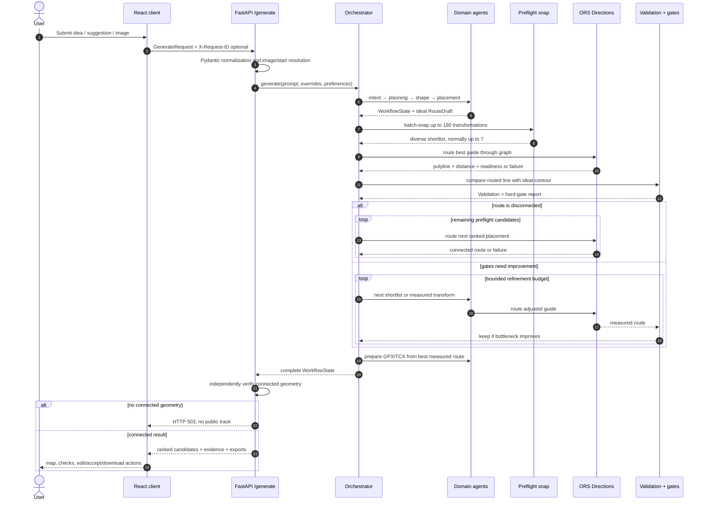
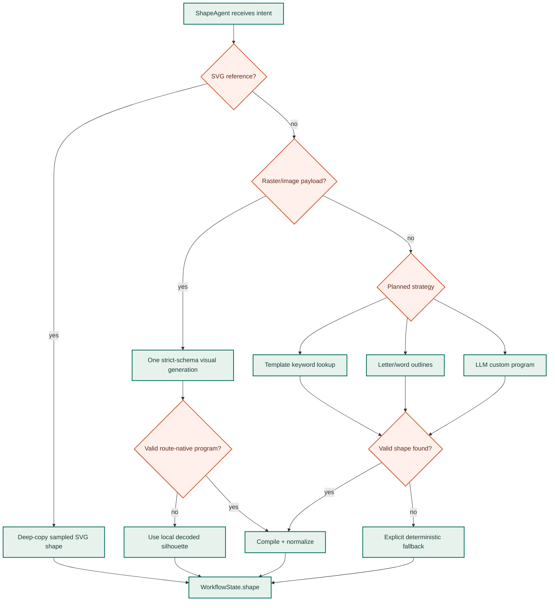
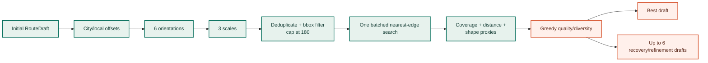
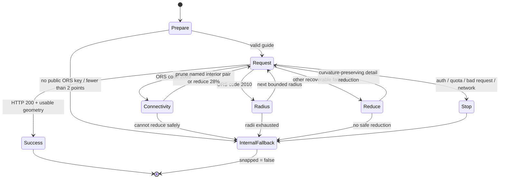
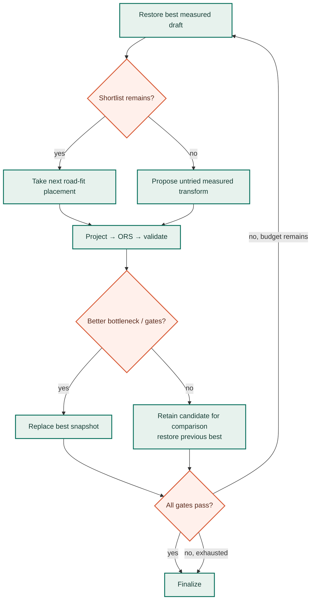

# Backend route-generation pipeline

The generation path is a bounded search over shape geometry and street-network placements. It is not a single “draw then snap” operation: the system preserves an ideal contour, searches where that contour best fits streets, measures full routed alternatives, and retains evidence for every decision.

<div class="code-path" markdown>

Primary path: `POST /generate` → `api.routes.generate_route()` → `orchestrator.generate()` → `Orchestrator.run()` → `_state_to_response()`

</div>

## End-to-end sequence



## Stage ownership

| Stage | Reads | Writes | External work | Failure behavior |
| --- | --- | --- | --- | --- |
| Intent | `prompt` | `Intent`, history | Optional LLM only when local parsing is incomplete | Deterministic parser fallback |
| Planning | `Intent`, city/start context | `Plan` with strategy, city center/bbox, transforms, suggestions | Curated city lookup; optional geocoder/LLM | Defaults and deterministic recommendations |
| Shape | `Intent`, `Plan`, optional image | normalized `Shape`, `ShapeSpec`, semantic review | Optional model/image call | Template, text, local silhouette, or explicit fallback |
| Placement | `Shape`, `Plan` | initial `RouteDraft.waypoints` | Pure geometry | Raises on incomplete state |
| Preflight | draft, bbox, sport | ranked draft + remaining shortlist + diagnostics | ORS batch snapping | Original deterministic draft retained |
| Snap | selected draft, preferences | `SnappedRoute`, readiness | ORS Directions | Internal `snapped=False` diagnostic |
| Validation | ideal/routed lines, target | `Validation`, `EvaluatedCandidate` | Pure geometry | Missing prerequisite is an explicit error |
| Refinement | current best + history | next untried draft parameters | None by itself | Empty change ends that attempt |
| Export | best route + validation | `Export` | Pure GPX/TCX serialization; optional disk | Public API still rechecks connectivity |

## Local parsing before model inference

`IntentAgent` first runs its deterministic parser. If city plus shape/text/suggestion are complete, it skips the model call. Otherwise it asks the provider for a strict JSON object and then reconciles it with the local parse so a semantic drawing is not accidentally reduced to an initial.

Important normalization rules:

- sport is constrained to `run` or `bike`;
- non-finite or non-positive distances become absent;
- valid distances are clamped to sport bounds;
- suggestion intent is recognized through explicit English/Hungarian patterns;
- city accents and complete custom-subject descriptions are preserved;
- API-level `intent_override` replaces the parsed result only after the agent records its interpretation.

Provider selection is lazy. `llm.factory` builds configured providers in primary/fallback order, keeps the first successful generation provider sticky for coherence, and places failures in a 30-second probe cooldown. Independent visual review can explicitly exclude the generation provider and avoid pinning the reviewer.

## Shape selection hierarchy



All shape paths live in normalized unit space before placement. Multiple strokes remain explicit; transfer segments are part of route feasibility and cannot be ignored when solving approximate scale. See the [AI shape pipeline](../AI_SHAPE_PIPELINE.md) for schemas, cue verification, caching, and repair.

## Placement preflight: broad and cheap first

The expensive Directions endpoint is intentionally not the primary search primitive. `PreflightAgent` derives transformations from the initial draft:

- a city-wide 3×3 grid, plus the planned origin, when a valid city bbox exists;
- local 3×3 offsets when city coverage is insufficient;
- six rotations (`0°` through `150°` in `30°` steps), unless the user fixed a start direction;
- three scales (`1.0`, `0.85`, `1.15`);
- a hard `PREFLIGHT_MAX_PLACEMENTS` cap, 180 by default;
- only the fixed origin when the route is anchored to a user start point.



The shortlist is not top-k score alone. It starts with the highest-ranked result, then repeatedly maximizes:

```text
utility = 0.82 × preflight_score + 0.18 × minimum_diversity_to_selected
```

Diversity combines spatial separation (50%), orientation difference (30%), and log-scale difference (20%). This avoids spending every Directions call on essentially the same block and rotation.

!!! note "What preflight proves"

    A successful nearest-edge match proves that guide points are near routable edges. It does not prove that consecutive points belong to one connected path. Full Directions routing remains the connectivity authority.

## Guide-point budgeting

`ors_client._subsample()` is curvature-preserving rather than index-uniform. It retains authored vertices and sharp corners, then bisects the longest uncovered arcs until the visual budget or ORS hard limit is reached. This prevents a sparse shape from giving the router several kilometres of unconstrained freedom while also avoiding unnecessary via-points that cause U-turn scribbles.

The request payload contains:

- `[longitude, latitude]` coordinates;
- configured `preference` and `continue_straight`;
- one radius per via-point;
- elevation plus surface, steepness, waytype, and suitability extras;
- supported avoid features (`steps`, `ferries`, `fords`);
- walking-profile quiet/green weightings when requested.

The response parser validates coordinate order/ranges, accepts summary distance or a segment sum, computes geometry distance independently, and uses the greater value so malformed summaries cannot under-report the line.

## Bounded ORS retry machine



Error-specific handling matters:

- **2009 connectivity:** widening the radius cannot connect two graph components. The implementation removes the interior point identified by ORS when safe, otherwise reduces guide detail by roughly 28% while preserving endpoints/closure.
- **2010 no nearby edge:** only this class widens the snap radius.
- **400/401/403/413/429 or network error:** stop early; repeating a paid/auth/quota failure provides no value.
- **Success:** compute fidelity against the prepared guide immediately and attach normalized route readiness.

When every bounded attempt fails, the function returns a diagnostic connector with `snapped=False`. That result can be scored and logged, but it is not public route geometry.

## Road recovery across placements

If the first full Directions candidate is disconnected, `_recover_unroutable_placement()` consumes the remaining preflight-ranked drafts in order. Each candidate receives a fresh snap and validation pass. Runtime/value/type failures are recorded in history with transform metadata but do not abort the bounded recovery loop.

The original unrouted draft is restored only when every shortlisted placement fails. The API then returns `503`; it does not expose the best-looking straight line.

## Validation and measured refinement

Validation compares the placed ideal guide with the returned street polyline in a shared metric frame. Every fully routed attempt is appended as an immutable `EvaluatedCandidate` before the orchestrator chooses the next action.

Refinement order:

1. consume remaining road-fit shortlist placements;
2. if distance error exceeds 8%, try the measured scale ratio `target / actual`;
3. also try the square root of that factor to bracket discontinuous road-network jumps;
4. when fidelity is low, tighten simplification and test bounded rotation/offset variants;
5. when closure is weak, prioritize a 0.93 scale reduction;
6. remember transform signatures so an already measured draft cannot consume the iteration budget again.



The comparison favors candidates that pass independent gates and improve the weakest normalized gate. Aggregate score is a late tie-breaker, not the first sort key.

## Suggestions and fallback shapes

Smart suggestion mode can measure up to three distinct geometry families selected from the full template registry using city traits, sport, and distance. It stops early when a connected candidate already passes every gate.

Explicit user-selected shapes follow a different rule: if the result is connected but weak, the requested drawing is retained for user review. A simpler shape does not silently replace it. Replacement logic is reserved for an unavailable-source substitution and must pass the same route/shape/usability gates; `FitDecision` records requested/selected metrics and reasons.

## API response assembly

`_state_to_response()` treats the workflow state as untrusted input at the public boundary:

1. validate `snapped`, point count, finite coordinate ranges, and positive measured distance;
2. rank candidates by selected-shape match, all-gates pass, connectivity, bottleneck, score, fidelity;
3. retain other-shape attempts only in `candidate_audit`;
4. suppress unrouted candidates from the selector;
5. sample full and ideal lines to at most 500 preview points;
6. regenerate GPX/TCX per connected candidate;
7. expose verification, transform, readiness, summary, and Street Canvas evidence;
8. issue gallery publish capabilities only for connected route results.

The endpoint performs one final `_has_connected_route()` check after orchestration. Failure becomes HTTP `503` with no public `gpx`, `tcx`, candidate, or gallery capability, even if an internal export object exists.

## Call-budget intuition

| Request type | Model calls | Preflight | Full Directions | Notes |
| --- | --- | --- | --- | --- |
| Known template with complete prompt | Usually 0 | Up to 180 transformations in batch | Best + bounded recovery/refinement | Local intent/planning/shape fast path |
| Free-text custom shape | Spec/generation, optional independent review, at most one repair | Same placement search | Same measured shortlist | Candidate count adapts from 2–4 |
| Linked SVG | 0 for shape extraction | Same | Same | Exact vector sampling |
| Linked raster | One primary multimodal strict-schema call | Same | Same | Local silhouette fallback, no provider cascade |
| Route edit | 0 | None | One bounded ORS retry sequence | Server re-routes browser control points |

Actual latency is dominated by external provider response time and the number of full Directions candidates, not by preview serialization. Performance changes should therefore be evaluated against candidate pass rate and fidelity, not wall-clock time alone.
