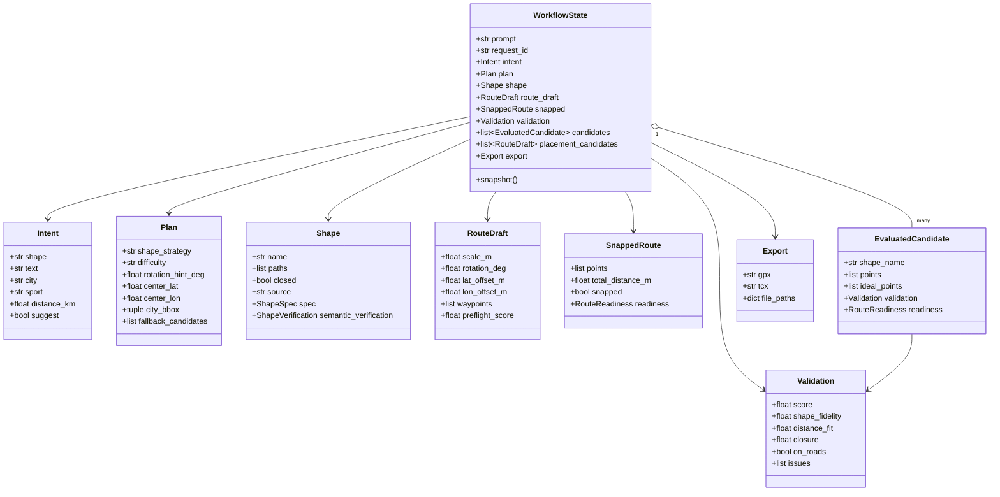
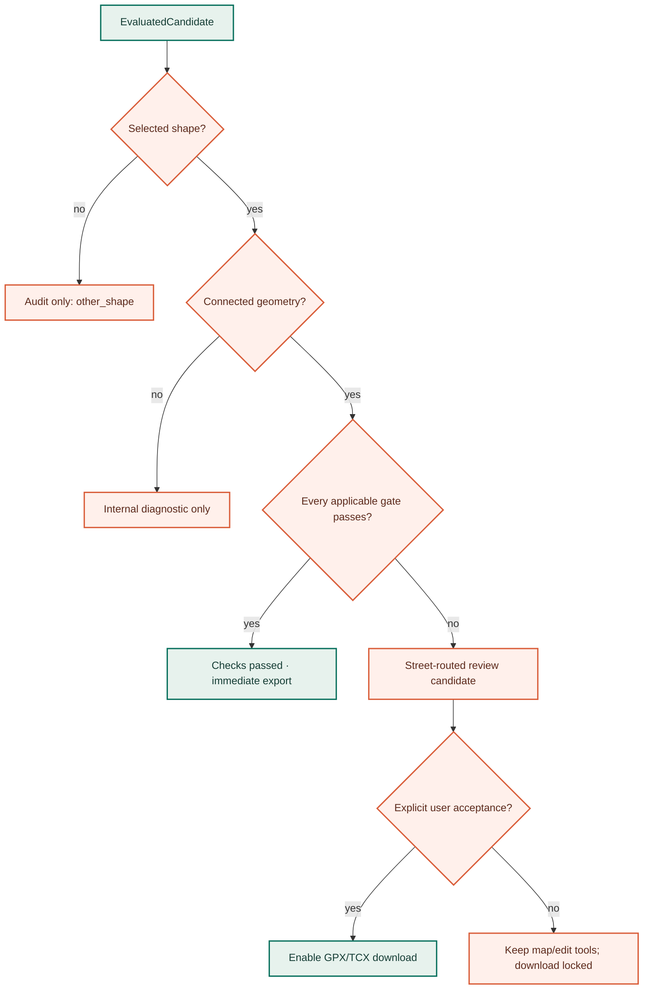

# State, metrics, and quality gates

GPS Art Wizard uses explicit dataclasses as its internal protocol. The state model is deliberately richer than the public response: it preserves search evidence, best-candidate snapshots, geometry transforms, and failure history so later stages do not need hidden agent memory.

## Core domain model



The complete model lives in [`state.py`](https://github.com/ak91hu/CityShapeRunner/blob/master/gps_art_wizzard/state.py). All coordinates use `(latitude, longitude)` internally. ORS request construction is the deliberate conversion point to `[longitude, latitude]`.

## State ownership and mutation


Agents mutate the request-owned `WorkflowState`, but candidate rollback uses deep copies. Before refinement, the orchestrator snapshots the best validation, snapped route, draft, and error list. A weaker measured candidate remains in `state.candidates` for comparison while the active state rolls back to the best snapshot.

`history` serves two purposes:

- a compact explainability trace returned by the API;
- a set of tested refinement signatures, preventing repeated scale/rotation/offset/tolerance combinations.

It is not a durable event store. Production diagnosis uses structured logs keyed by `request_id`.

## Shape geometry and placement transform

A `Shape` contains one or more unit-space paths. `PlacementAgent.project()` maps those paths into geographic waypoints using a `RouteDraft`:

```text
unit paths
  → normalize visible bounds
  → apply scale_m
  → rotate by rotation_deg
  → translate by lat_offset_m / lon_offset_m
  → project around center_lat / center_lon
  → connect or close path traversal
  → geographic guide waypoints
```

The projection is equirectangular around the city center, appropriate for city-scale routes. `scale_m` is solved from intended contour length, unavoidable stroke transfers, activity priors, and target distance; ORS measurements then drive corrections.

`RouteDraft.preflight_score`, coverage, and snap distance are proxy evidence only. `SnappedRoute.snapped` and the full ORS polyline establish routability.

## Validation formulas

`ValidationAgent` calculates three headline components.

### Closure

For a closed drawing with start/end gap `g` metres:

```text
closure = exp(-g / 200)
```

A 200 m gap scores approximately `0.37`. Open shapes receive `1.0`, but the closure gate is marked not applicable.

### Distance fit

With requested target `t` and actual distance `a`:

```text
relative_error = abs(a - t) / max(t, 1)
distance_fit   = exp(-3 × relative_error)
```

When no target exists, distance scores `1.0` inside the sport bounds and decays exponentially outside them.

### Shape fidelity

`shape_similarity.py` projects both lines into a shared metric frame and resamples by arc length. Its diagnostics combine:

| Diagnostic | What it detects |
| --- | --- |
| `spatial_similarity` | Ordered point-to-curve displacement, robust to route direction and closed-loop start vertex |
| `coverage_similarity` | Missing outline sections and large excursions |
| `turning_similarity` | Loss of characteristic direction-change sequence |
| `landmark_similarity` | Displaced dominant corners, notches, tips, and curvature events |
| `reversal_similarity` | U-turns/backtracking introduced by the street graph |
| `length_similarity` | Visually misleading detour length |
| `extent_similarity` | Width/height and silhouette proportion collapse |

The resulting fidelity is an exponential combination of these diagnostics, so one severe geometric deviation meaningfully lowers the aggregate. The quality module still gates each diagnostic independently.

### Overall score

```text
closed shape: 0.50 × fidelity + 0.30 × distance_fit + 0.20 × closure
open shape:   0.60 × fidelity + 0.40 × distance_fit
```

If `snapped=False`, fidelity is capped at `0.3` and overall score at `0.4`. If fidelity misses the configured minimum, a monotonic recognition cap keeps overall score below the acceptance threshold; accurate distance cannot compensate for an unrecognizable route.

## Authoritative hard gates

`quality.py::quality_gate_report()` is shared by orchestration, API ranking, editing, exporting, and UI evidence. Defaults come from configuration (`0.72` overall, `0.70` shape, `0.60` usability).

| Group | Gate | Default minimum | Why independent? |
| --- | --- | ---: | --- |
| Shape | Selected shape identity | exact match | Prevents an alternative-shape attempt entering the active selector |
| Route | Connected street route | `true` | Blocks straight guides and malformed route geometry |
| Route | Overall quality | `0.72` | Composite sanity target |
| Shape | Combined likeness | `0.70` | Aggregate recognition floor |
| Shape | Ordered curve | `0.70` | Coverage alone ignores traversal order |
| Shape | Outline coverage | `0.70` | Ordered samples alone can miss omitted regions |
| Shape | Characteristic turns | `0.70` | Preserves recognizable direction changes |
| Shape | Salient landmarks | `0.70` | Protects tips, corners, and notches |
| Shape | No unintended backtracking | `0.70` | Rejects graph-induced scribbles |
| Shape | Detour control | `0.70` | Rejects misleading extra strokes |
| Shape | Width/height preservation | `0.70` | Rejects collapsed proportions |
| Usability | Target distance | `0.60` | Keeps activity length meaningful |
| Usability | Loop closure | `0.60` when closed | Keeps closed art operationally closed |



## Bottleneck ranking

`quality_bottleneck()` divides each applicable numeric value by its minimum and returns the smallest ratio. An unrouted validation always returns zero.

Candidate API ranking is lexicographic, descending:

```text
1. selected shape matches
2. every gate passes
3. route is connected
4. weakest normalized gate
5. aggregate score
6. aggregate fidelity
```

This ordering prevents a `0.90` average with one failed landmark gate from outranking a lower-average route that actually satisfies all requirements.

## Internal state versus public response

| Internal evidence | Public handling |
| --- | --- |
| All `EvaluatedCandidate` objects | Selected-shape + connected candidates enter `candidates`; every attempt enters compact `candidate_audit` |
| Full ORS polylines | Preview sampled to ≤500 points; GPX/TCX keeps complete geometry |
| Straight-line fallback | May appear in internal validation/history; never selectable/exported |
| Preflight transforms | Compact diagnostics and up to 12 Street Canvas locations |
| Shape spec/provider usage | Included as drawing evidence without API keys or raw provider payloads |
| Readiness surfaces/concerns | Normalized summaries and bounded segment previews |
| Export object | GPX/TCX exposed only after independent connected-geometry check |

The public serializer also clamps trust in domain flags: `candidate.snapped=True` is insufficient by itself. It validates coordinate collection type, minimum point count, finite latitude/longitude ranges, and positive finite distance.

## Readiness is evidence, not routing authority

ORS extras are normalized into `RouteReadiness`:

- elevation gain/loss and maximum grade;
- surface-known share and unpaved share;
- normalized surface categories;
- concern codes with severity, distance/share, segment count, and bounded map previews;
- `ready`, `review`, or `unavailable` status plus data-quality classification.

Missing readiness data does not turn a connected street route into an unrouted route, and good readiness does not override failed shape gates. The concepts remain separate by design.

## Export semantics

`ExportAgent` prepares GPX and attempts TCX from the best measured geometry. It appends an `export-warning` when automatic gates fail and writes server-side files only when `EXPORT_DIR` is set **and** every gate passes.

The final safety boundary is later: `_state_to_response()` emits top-level GPX/TCX only for a connected primary route. Per-candidate exports are generated only after the same geometry validator passes. The React client then requires either all automatic checks or explicit acceptance before download.

This layered model intentionally uses defense in depth:


No single boolean is trusted across every layer.
