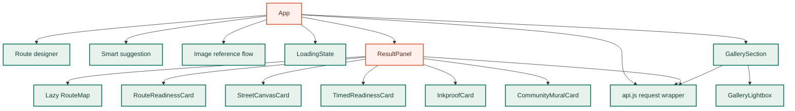
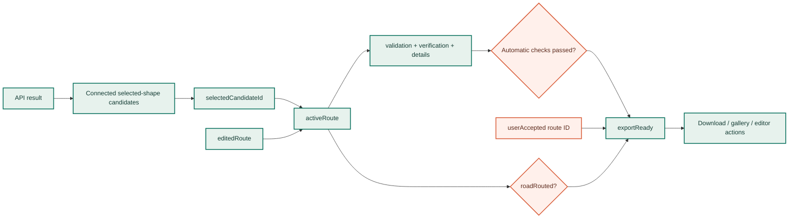
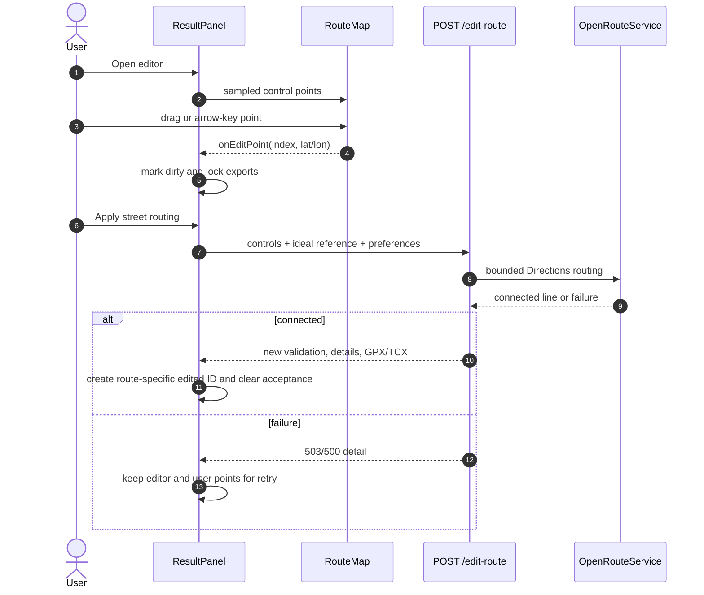

# Frontend implementation

The browser application is a React 19 single-page workflow built with Vite. It does not calculate a route or decide whether geometry follows streets; it validates user-facing inputs, calls the API, renders server evidence, and gates actions from explicit route state.

<div class="code-path" markdown>

Entry: `frontend/src/main.jsx` → `App.jsx` · transport: `api.js` · map: lazy-loaded `RouteMap.jsx` · presentation: `styles.css`

</div>

## Component topology



`RouteMap` is loaded with `React.lazy()` and `Suspense`, keeping Leaflet and map-specific code out of the initial interaction path. The rest of the interface remains in one module because the result controls share tightly coupled candidate/edit/download/gallery state; isolated feature cards maintain their own request state.

## Top-level application state

The `App` component owns request-level concerns:

| State | Purpose |
| --- | --- |
| `prompt`, `promptError`, validation attempt | Route idea and accessible validation/focus recovery |
| suggestion city/sport/distance + errors | Structured suggestion workflow |
| image URL/city/sport/distance + errors | Reference-image workflow |
| `loading`, `loadingKind` | One active route/image request and matching wait copy |
| `result`, `error` | Mutually replaced terminal request state |
| `lastGenerationRef` | Exact prompt/payload for a faithful retry |
| `requestRef` | Active `AbortController` for supersession, cancellation, and unmount cleanup |
| gallery refresh/published asset | Cross-component gallery synchronization |
| focus refs | Move focus to result, error, or first invalid control |

The interface allows one generation at a time. Starting a new request aborts the previous browser request, clears old result/error state, and remembers the exact payload. The `finally` block clears loading only when its controller is still the active controller, preventing an older aborted request from hiding a newer loading state.

## Generation state machine

```mermaid
stateDiagram-v2
    [*] --> Designing
    Designing --> Invalid: submit malformed input
    Invalid --> Designing: input corrected
    Designing --> Loading: valid prompt / suggestion / image
    Loading --> Designing: user cancels
    Loading --> Result: API success
    Loading --> Error: non-abort failure
    Error --> Loading: retry exact payload
    Error --> Designing: edit idea
    Result --> Loading: generate another / retry
    Result --> Editing: open route editor
    Editing --> Result: discard or successful reroute
    Editing --> Editing: reroute error; retain points
```



### Input normalization

Before network work:

- prompt whitespace is normalized and unsupported/control-only ideas are rejected;
- suggestion distance is parsed as a finite number and checked against activity bounds;
- an image reference must be public HTTP(S), while city/sport/distance are validated independently;
- errors are connected to controls and focus moves to the first failing input;
- quick-idea and catalog selection update both visual selected state and prompt value.

Server-side Pydantic validation remains authoritative. Browser validation exists to shorten feedback and preserve the user's context.

## Transport, cancellation, and timeouts

`api.js` builds requests against `VITE_API_BASE` with a trailing slash removed. Empty base means same origin, which is the production default.

Every call gets an internal `AbortController`. A caller-supplied signal is forwarded, and a separate timeout aborts the same controller. Error normalization distinguishes:

1. timeout → endpoint-specific actionable `ApiError`;
2. caller cancellation → `AbortError` so the UI remains quiet;
3. non-2xx JSON with string `detail` → server message and status;
4. malformed/empty success → explicit missing-response error;
5. network failure → generic reachability message.

| Operation | Browser timeout |
| --- | ---: |
| Health | 7 s |
| Normal generation | 180 s |
| Image generation | 120 s |
| Route editing/recognition repair | 180 s |
| Gallery list/delete | 15 s |
| Gallery publish | 45 s |
| Timed readiness | 8 s |
| Mural plan | 20 s |
| Inkproof analysis | 30 s |

!!! note "Cancellation boundary"

    `AbortController` stops the browser from waiting and prevents an obsolete result from updating UI state. `/generate` is a synchronous FastAPI handler, so a client disconnect is not a guaranteed cancellation token for every model/ORS call already running on the server. Upstream work remains bounded by provider timeouts and the configured search budget.

## Waiting experience

`LoadingState` maintains elapsed seconds, rotates topic-specific explanatory stages, supports explicit cancellation, and respects `prefers-reduced-motion`. The stage labels are illustrative product guidance, not server progress events or a percentage-complete promise.

This distinction avoids a misleading progress bar while still explaining why route generation takes time: drawing, placement search, street routing, comparison, and export preparation.

## Result derivation

`ResultPanel` receives an immutable API result and owns interaction state for that result. It resets local state when `request_id` or prompt changes.



The active route is derived in this order:

```text
editedRoute
  ?? selected API candidate
  ?? top-level primary response fields
```

Switching candidates clears editor state, consent, gallery errors, published state, concern selection, and analytical overlays. Acceptance is stored as a set of route IDs, so approval of one review candidate cannot leak to another candidate or edited version.

## Download gate

The browser computes:

```text
roadRouted = Boolean(activeRoute.snapped)
exportReady = roadRouted && (automaticChecksPassed || userAccepted)
```

Unfinished edits add a second block. A download action therefore requires:

- server-returned connected-route state;
- complete GPX/TCX content;
- all automatic gates **or** explicit acceptance of that exact route ID;
- no dirty unsubmitted control-point edit.

Before a review download, acceptance metadata is sent to `/route-acceptance`. Telemetry failure does not destroy the already connected route or block the user's approved download, but unrouted acceptance returns `409` at the API.

## Online route editor

The editor starts from a bounded sample of route preview points (maximum 18) rather than making hundreds of ORS vertices draggable. For closed routes, changing the first or last control point synchronizes the paired endpoint.



The server recomputes the entire route, validation, verification, readiness, and exports. The browser never turns the draggable polyline directly into GPX.

## Map rendering layers

`RouteMap` owns one Leaflet map, one tile layer, and one route `LayerGroup`. Coordinate props are normalized with `useMemo`; the layer group is rebuilt when route/evidence props change.

| Layer | Visual encoding | Source |
| --- | --- | --- |
| Ideal contour | orange dashed 3 px | `ideal_preview` |
| Connected accepted route | green solid 5 px | active route points |
| Connected review/unrouted preview | amber; unrouted is dashed | active route + status |
| Readiness concerns | red/ochre 8–11 px, active emphasis | bounded `segments_preview` |
| Inkproof/analysis | purple/magenta dash patterns | analysis endpoint |
| Street Canvas | ranked blue circle markers | preflight diagnostics |
| Recognition landmarks | small cue markers | salient ideal points |
| Editor handles | numbered keyboard/draggable points | sampled controls |

Map initialization enables rotation, disables scroll-wheel zoom by default, and observes container resize so responsive layout changes call `invalidateSize()`. Rotation uses a near-zero internal bearing for north-up because the rotating Leaflet renderer otherwise unmounts SVG layers at exact zero.

## Map screenshot publication

The gallery does not screenshot arbitrary page HTML. `RouteMap.capturePng()`:

1. waits for visible tiles and fonts;
2. validates minimum rendered size;
3. creates a canvas capped at 2× device pixel ratio;
4. draws only visible map tiles using their screen transforms;
5. redraws ideal, route, concern, and analysis paths from coordinates;
6. draws start/end markers;
7. adds visible OpenStreetMap attribution;
8. returns a PNG data URL or an actionable error.

The publish request also requires the server-issued capability token and `confirm_public_location: true`. The returned removal token is stored locally only for that asset. Gallery list state remains useful even if route generation or publication fails.

## Accessibility implementation

- Skip link moves directly to the route designer.
- Result and error containers receive programmatic focus when they appear.
- Invalid forms focus the first erroneous control and retain entered values.
- Primary controls maintain a 44 px activation floor.
- Editor points expose labels and keyboard arrow movement; `Shift` uses the documented larger step.
- Map has a descriptive region label that distinguishes street route, editor, and preview-only states.
- Lightbox manages initial/return focus and keyboard navigation.
- Busy and result messages use appropriate live regions without announcing animation frames.
- Reduced-motion mode preserves elapsed time and textual stages while removing decorative movement.

## Testing seams

Playwright intercepts API, gallery, and tile requests with deterministic fixtures. Tests run the same functional scenarios in desktop Chromium and Pixel 7 emulation with one worker because Leaflet/ResizeObserver teardown is more deterministic that way.

High-value behavioral assertions include:

- straight-line previews have no acceptance or export action;
- candidate switching updates every metric/export field and clears scoped state;
- dirty edits block all exports and survive API failure;
- cancellation produces no error and restores the designer;
- reduced motion remains informative;
- gallery failure stays isolated from route generation;
- controls remain ordered, reachable, and at least 44 px on narrow layouts.

See the [testing guide](../testing.md) for commands and suite ownership.
