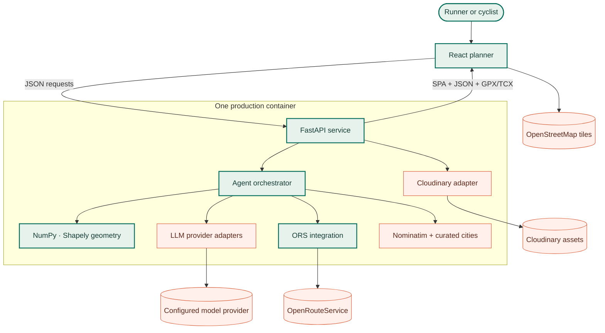
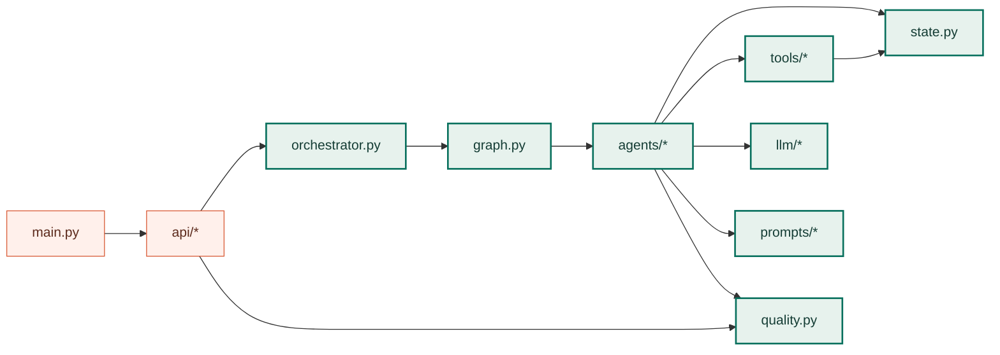

# Engineering implementation overview

# From drawing intent to a street-connected activity

This guide documents the implementation behind GPS Art Wizard: module boundaries, state ownership, route-search mechanics, quality gates, browser behavior, failure containment, and deployment topology. It is written from the checked-in code rather than from a conceptual target architecture.

[Trace one generation](backend-pipeline.md){ .md-button .md-button--primary }
[Inspect the state model](data-and-quality.md){ .md-button }

<strong>9</strong>stateless agents

<strong>≤180</strong>preflight placements

<strong>≤7</strong>Directions shortlist

<strong>13</strong>independent gates

<strong>500</strong>preview point cap

## Non-negotiable runtime invariants

The code is organized around four contracts. A change that violates any of them is a behavior regression even when its average score or latency improves.

| Invariant | Enforced by | Practical effect |
| --- | --- | --- |
| Public GPS geometry follows connected streets | `api/routes.py::_has_connected_route`, `/generate`, `/edit-route` | A straight-line diagnostic never becomes a selectable route or GPX/TCX response |
| Quality is a set of hard gates, not one average | `quality.py::quality_gate_report` | Good distance cannot hide a lost outline, landmark, turn sequence, or excessive detour |
| Explicit shapes are not silently replaced | `Orchestrator._evaluate_fallback_candidates` | A routable but weak requested drawing remains visible for user review; substitutions are explained |
| Agents are request-stateless | `WorkflowState`, `BaseAgent`, `Orchestrator` | All cross-stage data is inspectable in one object; agents do not retain user route state |

!!! danger "The most important boundary"

    `ors_client.snap_route_detailed()` may create an internal `snapped=False` straight-line connector so validation can explain the failure. The FastAPI serialization boundary independently revalidates the geometry and withholds every public export unless `snapped=True`, at least two finite coordinates exist, and the measured distance is positive.

## System context

The application uses one origin in production: FastAPI serves both the compiled React SPA and the API. Vite provides a development proxy for selected endpoints locally. Provider keys stay in the Python process; the browser receives no ORS, LLM, or Cloudinary secret.

## Dependency direction

The intended direction is inward toward domain state and pure geometry. `tools/` does not import the web UI, and agents do not know HTTP status codes. FastAPI converts domain failures and incomplete state into public error contracts.

## Source map

| Area | Primary implementation | Key responsibility |
| --- | --- | --- |
| Process and middleware | [`gps_art_wizzard/main.py`](https://github.com/ak91hu/CityShapeRunner/blob/master/gps_art_wizzard/main.py) | FastAPI creation, CORS, request IDs, structured request timing, SPA mount |
| HTTP contracts | [`gps_art_wizzard/api/routes.py`](https://github.com/ak91hu/CityShapeRunner/blob/master/gps_art_wizzard/api/routes.py) | Pydantic models, error mapping, response ranking, export boundary |
| Workflow graph | [`gps_art_wizzard/orchestrator.py`](https://github.com/ak91hu/CityShapeRunner/blob/master/gps_art_wizzard/orchestrator.py) | Linear pass, road recovery, bounded refinement, suggestion/fallback evaluation |
| Node registry | [`gps_art_wizzard/graph.py`](https://github.com/ak91hu/CityShapeRunner/blob/master/gps_art_wizzard/graph.py) | Agent construction and visible linear order |
| Cross-node state | [`gps_art_wizzard/state.py`](https://github.com/ak91hu/CityShapeRunner/blob/master/gps_art_wizzard/state.py) | Typed dataclasses for intent, shapes, drafts, routes, validation, readiness, export |
| Acceptance policy | [`gps_art_wizzard/quality.py`](https://github.com/ak91hu/CityShapeRunner/blob/master/gps_art_wizzard/quality.py) | Authoritative independent gates and bottleneck ranking |
| Street routing | [`gps_art_wizzard/tools/ors_client.py`](https://github.com/ak91hu/CityShapeRunner/blob/master/gps_art_wizzard/tools/ors_client.py) | Guide budgeting, ORS payloads, bounded retries, readiness extraction |
| Shape comparison | [`gps_art_wizzard/tools/shape_similarity.py`](https://github.com/ak91hu/CityShapeRunner/blob/master/gps_art_wizzard/tools/shape_similarity.py) | Metric projection, resampling, outline/turn/landmark/reversal diagnostics |
| Browser workflow | [`frontend/src/App.jsx`](https://github.com/ak91hu/CityShapeRunner/blob/master/frontend/src/App.jsx) | Input flows, cancellation, result selection, edit/download/gallery state |
| Map renderer | [`frontend/src/RouteMap.jsx`](https://github.com/ak91hu/CityShapeRunner/blob/master/frontend/src/RouteMap.jsx) | Leaflet layers, rotation, keyboard edit points, readiness overlays, PNG capture |
| Browser transport | [`frontend/src/api.js`](https://github.com/ak91hu/CityShapeRunner/blob/master/frontend/src/api.js) | Same-origin base, timeouts, abort forwarding, normalized errors |

## One request, four implementation layers

=== "1 · HTTP boundary"

    `GenerateRequest` normalizes Unicode/whitespace, limits the prompt to 320 characters, rejects control-only content, validates coordinate ranges, allows only one start source, and imports a reference image before the orchestrator is entered.

=== "2 · Domain pipeline"

    The orchestrator owns edges and loop decisions. Each agent implements `run(state) -> state`, writes its owned state fields, and records a compact history/log event.

=== "3 · Routing and evidence"

    Placement preflight searches transformations cheaply; Directions proves graph connectivity; validation computes recognition and usability evidence; the quality module applies hard gates.

=== "4 · Presentation and decision"

    The API ranks only connected candidates for the selected shape, samples map previews, creates per-candidate exports, and returns explicit verification details. React derives UI affordances from those facts instead of recalculating route geometry.

## Deep-dive routes

### Backend pipeline

Agent order, preflight funnel, ORS retry logic, road recovery, measured refinement, and response assembly.

[Follow the backend sequence](backend-pipeline.md)

### State and quality

Dataclass relationships, ownership, metric formulas, hard gates, candidate ranking, and export rules.

[Inspect data and quality](data-and-quality.md)

### Frontend

React state boundaries, cancellation, result editing, safe download gating, Leaflet layers, and gallery capture.

[Trace the browser implementation](frontend.md)

### Runtime and reliability

Container topology, external dependencies, request-correlated logging, failure containment, CI/CD, and operational checks.

[Operate the system](runtime-reliability.md)

## Safe extension patterns

### Add a new built-in shape

1. Add normalized unit-space paths and keywords to the appropriate catalog in `tools/`.
2. Preserve a meaningful path traversal order; similarity compares ordered curves as well as coverage.
3. Add shape-library and keyword-resolution tests.
4. Run route-engine tests against representative grids; visual similarity in unit space does not prove street routability.
5. Update the public catalog documentation only after the implementation and tests agree.

### Add a pipeline stage

1. Create a stateless `BaseAgent` subclass with one owned state transition.
2. Add typed output to `WorkflowState`; do not hide cross-stage data in instance fields.
3. Register the node in `graph.build_nodes()`.
4. Add the edge and failure behavior explicitly in `Orchestrator`.
5. Record history and structured event fields without prompt text, secrets, or full route geometry.
6. Test missing prerequisites, normal output, malformed provider output, and downstream failure.

### Add a quality metric

1. Calculate the diagnostic in `tools/shape_similarity.py` or another pure tool.
2. Store it on `Validation` and include it in `ValidationAgent` logs.
3. Add a named gate to `quality_gate_report()` when it is independently required.
4. Expose the gate through API serialization rather than duplicating a frontend threshold.
5. Add ranking tests proving a high average cannot mask the failed metric.

### Add an API endpoint

Keep Pydantic validation at the boundary, domain logic outside the route function, provider exceptions mapped to stable status codes, and `X-Request-ID` propagation untouched. Update the [HTTP API reference](../api-reference.md) and error-branch tests in the same change.

## Architectural trade-offs

- The API uses synchronous route generation. This keeps state local and simple, but a client disconnect is not a distributed cancellation signal to every upstream provider call.
- The state object is deliberately rich. It increases response/debug structure but avoids opaque agent memory and makes rollback to the best measured candidate deterministic.
- Preflight prioritizes breadth before Directions depth. It reduces expensive calls, but nearest-edge success is only a proxy; road recovery is still required.
- Quality gates favor false rejection over misleading GPS tracks. A user may explicitly accept a connected review candidate, but never an unrouted guide.
- One container simplifies same-origin deployment and secret handling. CPU-heavy geometry and synchronous external calls should be scaled through measured replicas, not additional Uvicorn workers by assumption.
