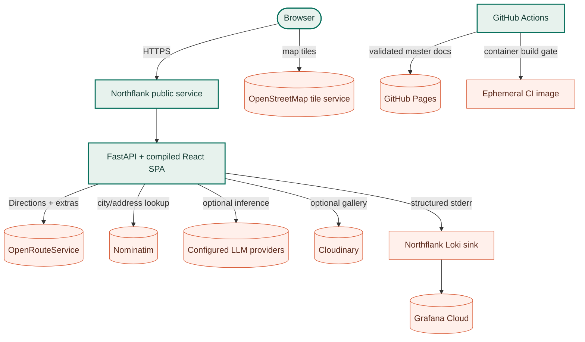
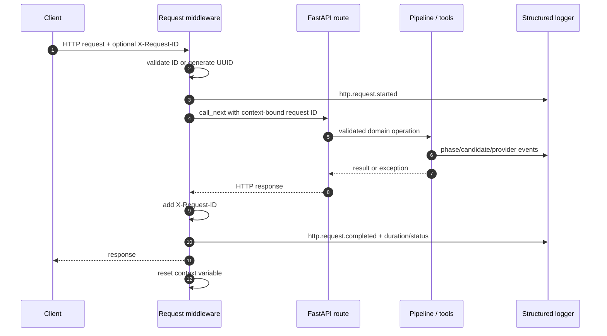
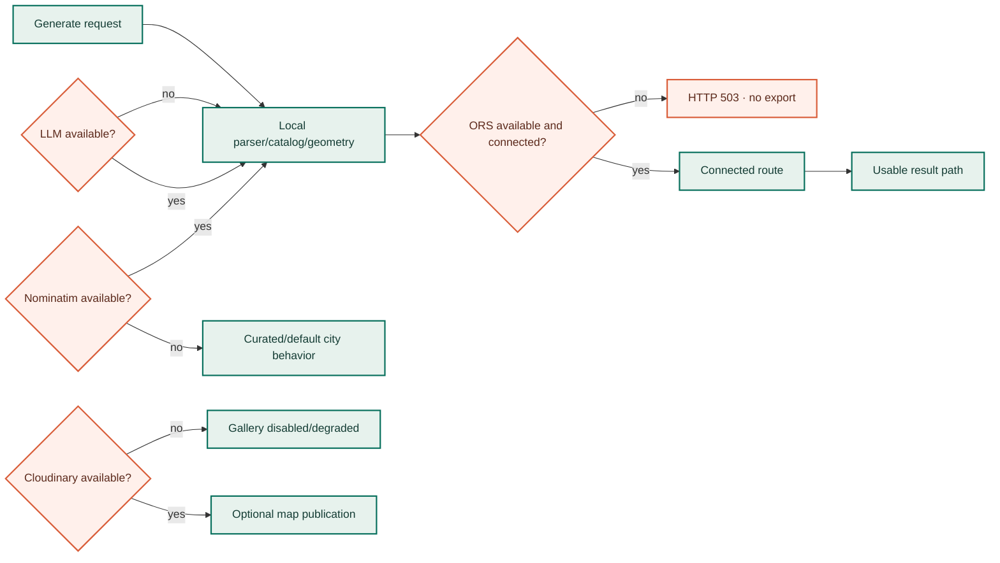
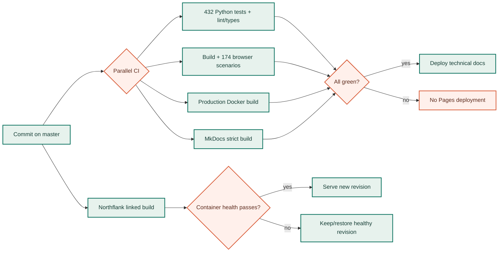

# Runtime, observability, and reliability

Production uses a single non-root container that serves the compiled React SPA and FastAPI API from one origin. External systems are optional by feature except street routing, which is mandatory for public route exports.

The [external API integration guide](../external-apis.md) is the endpoint-level companion to this operational view, including credentials, request payloads, provider policies, and bounded failure behavior.

## Deployment topology

The application service and documentation have separate delivery targets. Northflank follows `master` for the runtime container; GitHub Actions publishes MkDocs to Pages only after backend, frontend, container, and strict-doc jobs succeed.

## Container build

The root `Dockerfile` has three stages.

| Stage | Base | Work |
| --- | --- | --- |
| `frontend-build` | `node:24-alpine` | `npm ci`, copy frontend source, `npm run build` |
| `python-build` | `python:3.14-slim-bookworm` | install the package and selected provider extra into `/runtime` |
| `runtime` | `python:3.14-slim-bookworm` | copy installed Python runtime, source package, config/docs, and SPA assets |

Runtime hardening and behavior:

- fixed unprivileged UID/GID `10001`;
- working directory `/app`;
- no Node/npm or Python build tools copied from build stages;
- `PYTHONDONTWRITEBYTECODE=1`, unbuffered logs, explicit `PYTHONPATH`;
- `API_HOST=0.0.0.0`, production JSON logging, empty local log file;
- dependency-free `/health` container check every 30 seconds;
- `SIGTERM` is the stop signal;
- one `gps-art-wizzard` Uvicorn process by default.

`INSTALL_EXTRAS=opencode` is the normal image. `all` adds Anthropic; an empty value produces deterministic/provider-free shape behavior. ORS still remains required for public routes.

## Process startup and request lifecycle

`main.py` configures logging at import, creates FastAPI, installs CORS and request middleware, registers three routers, then mounts `frontend/dist` last so API and OpenAPI routes take precedence over the SPA catch-all.

Client request IDs are accepted only when 1–80 characters from the safe ASCII set are used. Otherwise a UUID is generated. A `ContextVar` attaches the ID to log records even across nested domain calls.

## Structured log contract

Every JSON record includes:

- UTC timestamp, severity/level, logger, message;
- service, environment, optional release revision;
- request ID;
- allowlisted event-specific numeric/string fields.

The formatter deliberately does not serialize arbitrary object attributes. Important event families:

| Family | Example events | Operational question |
| --- | --- | --- |
| HTTP | `http.request.started`, `http.request.completed`, `http.request.failed` | Is latency/error isolated to one endpoint or revision? |
| Generation | `generation.requested`, `generation.completed` | How many candidates/iterations did a request need? |
| Workflow | `workflow.started`, `workflow.step.*`, `workflow.finished` | Which stage is slow/failing, and did AI fall back? |
| Routing | snap/recovery logs, `generation.street_routing.unavailable` | Is ORS unreachable, quota-limited, or unable to connect guides? |
| Validation | `route.validation.completed`, `route.candidate.evaluated` | Which gate is the recurring bottleneck? |
| Response | `route.response.prepared` | How many verified/review/other-shape attempts reached the client? |
| Edit/export | `route.edit.*`, `route.export.prepared` | Did rerouting, validation, or serialization fail? |
| User decision | `route.user.accepted`, `route.user.acceptance.rejected` | Are users overriding a specific systematic gate? |
| Gallery | `gallery.*` | Is optional publication failing independently? |

Full prompts, provider keys, gallery secrets, GPX/TCX payloads, and complete route geometry are not log fields.

Every generation also owns a bounded typed workflow trace. Its public summary
contains status/mode, stage attempts, duration, AI-call/fallback counts, and
aggregated integer usage metrics; detailed events remain internal. See
[Production AI workflow](../ai-workflow.md).

## Dependency criticality

| Dependency | Required for process health? | Required for route export? | Degradation |
| --- | --- | --- | --- |
| ORS | No (`/health` still works) | **Yes** | Internal guide may be measured, public generation/edit returns `503` |
| LLM providers | No | No for templates/text/local fallback | Deterministic shape path; unsupported subjects explicitly fall back |
| Nominatim | No | Only for uncatalogued address/city resolution | Curated/default resolution or actionable `422` for address |
| Cloudinary | No | No | Gallery reports unconfigured or returns isolated errors |
| OSM browser tiles | No for API | No for GPX | Map tiles unavailable; route data remains in result |
| Grafana/Loki | No | No | Console logs remain, retention/search degraded |

## Failure containment by boundary

### Provider/model boundary

- Strict schemas constrain intent and shape output.
- JSON extraction and geometry compilation treat model text as untrusted.
- Provider failures enter a short cooldown and rotate through configured fallbacks.
- Deterministic fallbacks are explicit and bounded.
- Reference-image generation pins one provider/timeout and falls back locally instead of cascading latency.

### Routing boundary

- Coordinates, response geometry, and distances are validated.
- Authentication/quota/network failures do not fan out into repeated paid requests.
- Retry strategy depends on ORS error class.
- Every success is remeasured against the guide.
- No connected geometry means no public export.

### API boundary

- Pydantic rejects malformed lengths, coordinates, URLs, and mutually exclusive fields.
- Domain `ValueError`/known input failures map to `422`.
- Routing absence maps to `503` with an explanatory stable message.
- Unexpected internals map to `500` without leaking credentials/provider responses.
- Optional gallery failures use `403`, `422`, `502`, or `503` without breaking route generation.

### Browser boundary

- Requests have per-operation timeouts and abort propagation.
- Old request completion cannot overwrite a newer request.
- Review acceptance is scoped by route ID.
- Dirty editor state blocks stale exports.
- Gallery consent and removal capabilities are scoped to the active asset/route.

## Health versus readiness

`GET /health` proves only that the process can answer HTTP and reports whether the gallery is configured. It intentionally avoids paid/rate-limited provider calls.

Use layered production verification:

1. **Liveness:** `/health` returns `200` and the expected service/version.
2. **Static app:** `/` loads current SPA assets without mixed-origin errors.
3. **Contract smoke:** `/interpret` validates a known prompt without routing cost.
4. **Route smoke:** periodically generate a small known template with ORS and verify `snapped=true`, connected candidate(s), and GPX XML.
5. **Quality monitoring:** track failed gate IDs and `generation.street_routing.unavailable` by revision.

Do not turn the paid route smoke into the container health check; it would consume quota and make external incidents restart healthy application processes.

## Capacity and timeout model

Generation is synchronous and can combine CPU-heavy geometry with sequential upstream calls. Start with one process per container and scale container replicas only after measuring:

- p50/p95 generation duration by template/custom/image path;
- Directions calls and candidates per request;
- ORS/provider rate limits;
- CPU/memory during preflight and similarity diagnostics;
- proportion of client timeouts versus eventual server completion;
- routing failure and quality-gate distribution by city.

Browser timeouts are 120 seconds for image generation and 180 seconds for standard generation/editing. Hosting request timeouts must be at least compatible with those budgets, but increasing them is not a performance fix. Tune shortlist/refinement only with quality and failure-rate benchmarks.

## CI and release gate

GitHub Pages requires the repository's **Settings → Pages → Build and deployment → Source** to be **GitHub Actions**. Without that one-time setting, the strict MkDocs build can pass but `configure-pages` returns `Not Found` and deployment is skipped.

Application deployment is independently performed by Northflank's linked-repository configuration. The CI Docker job validates build reproducibility but is not itself the Northflank deploy action.

## Operational diagnosis

| Symptom | First evidence | Likely branch |
| --- | --- | --- |
| `/generate` returns `503` quickly | request ID + ORS error/status logs | key/auth/quota/network or no route near guides |
| `/generate` runs long then `503` | road recovery history + candidate/preflight count | several placements near roads but graph-disconnected |
| Route is connected but shown for review | `failed_gates` and bottleneck | recognition, detour, distance, or closure issue |
| Browser times out but server later logs completion | client timeout vs request completion timestamp | synchronous work outlived browser wait |
| Gallery fails, route still works | `gallery.*` only | Cloudinary config/token/upstream issue |
| Docs workflow fails at `configure-pages` | Pages action `Not Found` | Pages source not enabled for Actions |
| Container restarts | platform health/runtime logs | startup/import/env/port failure, not provider health |

See [Production deployment](../deployment.md) for Northflank and Grafana setup and [CI/CD](../ci-cd.md) for GitHub Pages permissions and rollback.

## Security boundaries

- All API keys and `CLOUDINARY_URL` are server-side environment secrets.
- `VITE_*` variables are public build-time values and must never contain credentials.
- Image imports reject non-HTTP(S), private-network destinations, oversized downloads, decompression-scale raster inputs, and invalid decodes.
- Gallery publication requires an explicit location confirmation plus a short-lived publish capability; deletion requires a separate asset token.
- Request IDs are sanitized before entering logs/headers.
- Exports describe the shape actually shown, not an unavailable requested label.
- The container runs non-root and does not require persistent storage by default.
