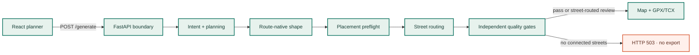

# GPS Art Wizard engineering guide

<div class="hero" markdown>

# Draw with streets, not across them

GPS Art Wizard turns a natural-language drawing idea into a route that follows a connected, routable street network. This site is the maintained engineering reference for the Python API, React client, route-generation pipeline, quality gates, deployment, and operations.

[Start developing](getting-started.md){ .md-button .md-button--primary }
[Explore the architecture](architecture.md){ .md-button }

</div>

## System contract

The product deliberately separates an **ideal drawing** from a **usable route**. The ideal geometry is a guide for placement and similarity scoring; only geometry returned by the routing provider may become an exportable activity route.

!!! danger "Fail-closed street-routing invariant"

    `/generate` and `/edit-route` must not return a GPX/TCX track when the route cannot be matched to connected streets. Routing failures produce HTTP `503`, rather than falling back to straight segments that can cross buildings, water, or inaccessible land.

The API still returns quality and readiness information for a routed result. Automatic checks help compare candidates, but do not replace checking live closures, access rules, traffic, weather, or personal ability.

## Documentation map

<div class="doc-grid" markdown>

<div class="doc-card" markdown>

### Build and run

Install the two runtimes, configure providers, start the API and SPA, and send a first request.

[Developer quick start](getting-started.md)

</div>

<div class="doc-card" markdown>

### Understand the pipeline

Follow intent parsing, shape design, placement search, street routing, validation, refinement, and export.

[Implementation guide](implementation/index.md) · [System architecture](architecture.md)

</div>

## Implementation at a glance



The [engineering overview](implementation/index.md) links every box to its owning module and expands the system into backend sequence, state/class, frontend state-machine, and runtime topology diagrams.

<div class="doc-card" markdown>

### Integrate with the API

Use the request models, response fields, error semantics, request correlation, and interactive OpenAPI UI.

[HTTP API reference](api-reference.md)

</div>

<div class="doc-card" markdown>

### Configure safely

Review every provider, routing, workflow, server, gallery, export, and logging setting with its default and scope.

[Configuration reference](configuration-reference.md)

</div>

<div class="doc-card" markdown>

### Protect behavior

Run backend unit/integration tests, browser-level functional tests, static analysis, and strict documentation builds.

[Testing guide](testing.md)

</div>

<div class="doc-card" markdown>

### Release and operate

Understand the Northflank application release and the gated GitHub Pages documentation release.

[CI/CD](ci-cd.md) · [Production deployment](deployment.md)

</div>

</div>

## Repository at a glance

| Area | Path | Responsibility |
| --- | --- | --- |
| API and runtime | `gps_art_wizzard/main.py`, `gps_art_wizzard/api/` | FastAPI app, request correlation, validation, public HTTP contracts |
| Orchestration | `gps_art_wizzard/orchestrator.py`, `gps_art_wizzard/graph.py` | Candidate generation, agent ordering, refinement loop |
| Domain agents | `gps_art_wizzard/agents/` | Intent, planning, shape, placement, snapping, validation, export |
| Geospatial tools | `gps_art_wizzard/tools/` | Geocoding, ORS integration, geometry, catalog, GPX/TCX, gallery |
| Web client | `frontend/src/` | React workflow, route map, result comparison and editing |
| Automated checks | `tests/`, `frontend/tests/` | Python and Playwright regression suites |
| Documentation | `docs/`, `mkdocs.yml` | MkDocs source, navigation, design, technical reference |
| Delivery | `.github/workflows/ci.yml`, `Dockerfile` | CI gates, Pages publication, production image |

## Fast verification

```powershell
# Backend quality gates
python -m ruff check .
python -m mypy --ignore-missing-imports gps_art_wizzard
$env:GEOCODE_OFFLINE = "1"
python -m pytest -q

# Frontend build and functional tests
Set-Location frontend
npm ci --no-audit --no-fund
npm run build
npm run test:e2e

# Documentation (from repository root)
Set-Location ..
python -m pip install -e ".[docs]"
python -m mkdocs build --strict
```

The generated documentation is written to `site/`; it is a build artifact and must not be edited by hand.
